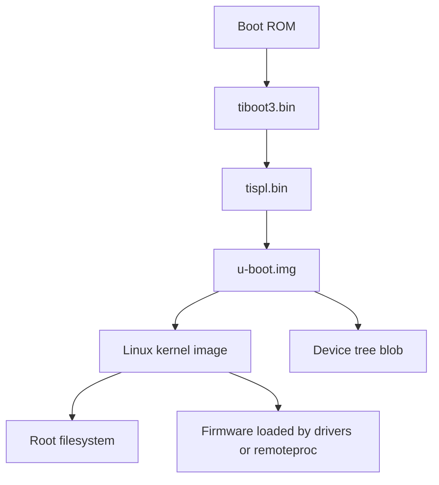

# Boot Artifact Pipeline

## Goal

Map TI SDK build outputs to the real boot chain on Sitara-class systems.

## Why This Matters

Boot failures are often artifact mismatch failures. You need to know which file was built by which recipe, which boot stage consumes it, and whether the file on the SD card/eMMC/flash actually matches your build.

## Typical Boot Artifact Flow

The exact boot chain varies by SoC family and security type, but modern TI Sitara systems often involve artifacts such as:

- `tiboot3.bin`
- `tispl.bin`
- `u-boot.img`
- kernel image
- DTB files
- overlays where used
- root filesystem
- firmware files
- WIC or SD-card image



Some devices and boot modes differ. Always check the selected SoC and SDK documentation.

## Artifact Ownership

Typical ownership:

| Artifact | Usually produced by | Notes |
| --- | --- | --- |
| `tiboot3.bin` | TI boot firmware / U-Boot related recipes | Often SoC/security-device specific |
| `tispl.bin` | U-Boot SPL flow | May include firmware handoff responsibilities |
| `u-boot.img` | U-Boot recipe | U-Boot proper |
| kernel image | kernel recipe | `Image`, `zImage`, or release-specific name |
| DTBs | kernel recipe | Board-specific hardware description |
| rootfs | image recipe | Package set and filesystem content |
| WIC image | image/WIC tooling | Assembles boot and rootfs partitions |
| remote firmware | firmware recipes | Loaded by bootloader, kernel, or remoteproc |

## Deploy Directory Inspection

Inspect:

```bash
ls -lh tmp/deploy/images/<machine>/
readlink -f tmp/deploy/images/<machine>/*u-boot*
readlink -f tmp/deploy/images/<machine>/*dtb*
readlink -f tmp/deploy/images/<machine>/*wic*
```

Yocto deploy directories often contain symlinks. Record both the stable symlink name and the versioned target.

## Runtime Verification

On the target, verify:

```bash
cat /proc/version
cat /proc/cmdline
dmesg | grep -i 'Machine model'
strings /proc/device-tree/model
uname -a
fw_printenv 2>/dev/null || true
```

From U-Boot, verify:

```text
version
printenv
bdinfo
fdt addr ${fdt_addr_r}
fdt print / model
```

The goal is to prove which U-Boot, kernel, DTB, rootfs, and firmware are actually running.

## WIC Image Role

A WIC image packages artifacts into a disk layout. It is not the original source of those artifacts. If a WIC image contains the wrong DTB, debug the deploy inputs and WIC configuration, not only the final `.wic`.

Questions to ask:

- Which `.wks` file is active?
- Which boot partition files are installed?
- Are symlinks resolved as expected?
- Does the board boot from the media you wrote?
- Is there an older copy of U-Boot in eMMC or SPI flash overriding the SD card?

## Common Mistakes

- Rebuilding U-Boot but booting an old copy from eMMC.
- Rebuilding the DTB but writing only the rootfs partition.
- Updating kernel modules without updating the kernel image.
- Mixing GP and HS/secure-device boot artifacts.
- Assuming the newest timestamp in deploy is the artifact used by WIC.
- Debugging Linux when the failure is really SPL or U-Boot handoff.

## Related Topics

- [U-Boot Integration](u-boot-integration.md)
- [Kernel Integration](kernel-integration.md)
- [Deployment and Flashing](deployment-and-flashing.md)
