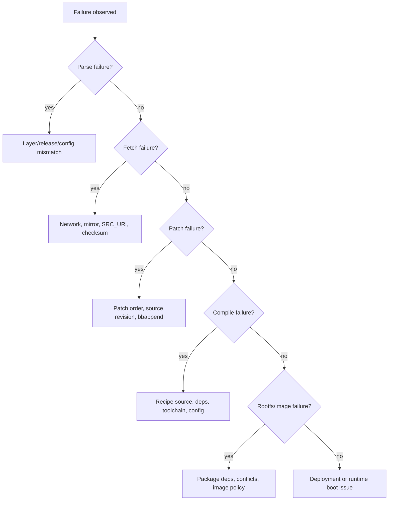

# Debugging TI SDK Builds and Boots

## Goal

Debug TI SDK failures by locating the failing layer: setup, metadata parsing, fetching, patching, compiling, packaging, image assembly, flashing, or boot.

## Build Failure Layers



## First Commands

Use:

```bash
bitbake-layers show-layers
bitbake-layers show-appends
bitbake -e <recipe> | less
bitbake <recipe> -c log
bitbake <recipe> -c devshell
```

Look in:

```text
tmp/work/<machine-or-arch>/<recipe>/<version>/temp/log.do_*
tmp/work/<machine-or-arch>/<recipe>/<version>/temp/run.do_*
```

The `run.do_*` script shows what BitBake actually executed.

## Common Build Failures

| Symptom | Likely area |
| --- | --- |
| `Nothing PROVIDES` | missing layer, wrong machine, provider policy |
| patch does not apply | source revision mismatch or patch already changed upstream |
| compile cannot find header | missing dependency or wrong sysroot assumption |
| rootfs conflict | two packages install same file or incompatible package selection |
| QA error | packaging, license, rpath, installed-vs-shipped issue |
| WIC failure | missing deploy artifact, wrong `.wks`, image dependency issue |

## Boot Failure Triage

Classify by last visible stage:

| Last stage seen | Focus |
| --- | --- |
| no serial output | power, boot mode, ROM, serial wiring |
| early boot only | `tiboot3.bin`, security type, boot media |
| SPL output | DDR, `tispl.bin`, firmware handoff |
| U-Boot prompt | environment, boot targets, media, kernel/DTB paths |
| kernel starts then panic | kernel config, DTB, rootfs, cmdline |
| userspace fails | image content, init system, services, mounts |

## Proving Artifact Mismatch

Artifact mismatch is common. Compare:

- file timestamps and checksums in deploy
- files on boot partition
- U-Boot version string
- kernel `uname -a`
- DTB model string
- `/lib/modules/$(uname -r)`
- image manifest

Use checksums when possible:

```bash
sha256sum tmp/deploy/images/<machine>/<artifact>
sha256sum /media/$USER/boot/<artifact>
```

## When To Clean

Cleaning can hide the real cause. Prefer targeted rebuilds:

```bash
bitbake <recipe> -c compile -f
bitbake <recipe>
bitbake <recipe> -c clean
```

Use `cleansstate` only when you understand that it removes shared-state entries for that recipe. Do not make full clean builds your default debugging method.

## Common Mistakes

- Rebuilding full images for every small kernel or U-Boot issue.
- Ignoring `run.do_*` scripts.
- Looking only at final console output instead of task logs.
- Cleaning everything before saving the failure log.
- Debugging userspace when the kernel booted with the wrong DTB.
- Debugging BitBake when the board is booting old media.

## Related Topics

- [Debugging BitBake Builds](../yocto-openembedded/debugging-bitbake-builds.md)
- [Boot Artifact Pipeline](boot-artifact-pipeline.md)
- [Deployment and Flashing](deployment-and-flashing.md)
