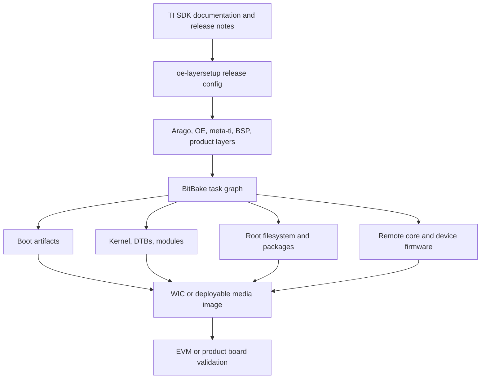

# TI Processor SDK Linux

## What Problem Does This Solve?

TI Processor SDK Linux is TI's integrated Linux BSP and distribution delivery for Sitara and other TI processors. It combines release documentation, prebuilt binaries, Yocto/OpenEmbedded metadata, Arago distribution policy, TI-maintained Linux and U-Boot trees, firmware packages, image targets, SDK installers, and board deployment workflows.

For a product engineer, the SDK is not only a set of downloads. It is the release boundary that defines which kernel, U-Boot, firmware, machine configuration, image recipe, toolchain, and documentation are expected to work together.

## SDK Build System Vs TI Yocto Layers

This distinction matters.

The **TI Processor SDK build system** is the complete vendor workflow around a specific SDK release. It includes documentation, installer layout, release notes, prebuilt images, validated EVM targets, setup scripts, pinned layer revisions, TI image targets, deployment artifacts, and instructions for flashing and validation. When you follow the Processor SDK instructions, you are using TI's release-integrated path.

The **TI Yocto layers** are the OpenEmbedded metadata components inside that workflow, such as TI BSP layers, Arago distribution layers, recipes, classes, machine files, image recipes, and `.bbappend` files. They can be inspected, extended, and sometimes reused outside the full Processor SDK installer flow, but they do not by themselves define the entire SDK experience.

Use the **Processor SDK workflow** when:

- you need to reproduce a TI-supported EVM image
- you want the least ambiguous baseline for a board bring-up
- you are following TI documentation, release notes, and known issues
- you need prebuilt artifacts, validation scripts, or SDK installer contents
- you want a supportable reference when asking TI or comparing against an EVM

Use the **TI Yocto layers directly** when:

- you already understand the release baseline and want to integrate TI BSP metadata into a larger Yocto product tree
- you need to maintain your own product distro, product images, CI, mirrors, and release manifests
- you want to treat TI metadata as vendor input rather than the top-level build environment
- you are migrating patches between SDK releases and need to reason at the layer/recipe level

The practical rule is: start from the Processor SDK to establish a known-good baseline, then move product ownership into your own Yocto layer while keeping TI layers as vendor inputs.

## Core Concepts

- SDK release
- EVM baseline
- Arago distribution
- TI BSP layers
- `oe-layersetup`
- `oe-layertool-setup.sh`
- `MACHINE`
- `DISTRO`
- `tisdk-default-image`
- boot firmware
- `tiboot3.bin`
- `tispl.bin`
- `u-boot.img`
- kernel image
- DTBs
- root filesystem
- WIC images
- PRU/R5/M4 firmware
- custom machine
- product layer
- SDK upgrade

## Mental Model

The SDK release anchors the whole graph. Mixing documentation from one SDK with layers from another SDK is a common way to lose time.

## Learning Materials

1. [SDK Overview and Release Model](sdk-overview-and-release-model.md)
2. [Processor SDK Build System vs TI Yocto Layers](sdk-build-system-vs-ti-yocto-layers.md)
3. [Installed SDK and Source Layout](installed-sdk-and-source-layout.md)
4. [Build Environment Setup](build-environment-setup.md)
5. [TI Yocto and Arago Build Flow](ti-yocto-arago-build-flow.md)
6. [Machines, Distros, and Image Targets](machines-distros-and-image-targets.md)
7. [Boot Artifact Pipeline](boot-artifact-pipeline.md)
8. [Kernel Integration](kernel-integration.md)
9. [U-Boot Integration](u-boot-integration.md)
10. [Firmware and Heterogeneous Cores](firmware-and-heterogeneous-cores.md)
11. [Custom Sitara Board Bring-Up](custom-sitara-board-bring-up.md)
12. [SDK Customization for Products](sdk-customization-for-products.md)
13. [Deployment and Flashing](deployment-and-flashing.md)
14. [Debugging TI SDK Builds and Boots](debugging-ti-sdk-builds-and-boots.md)
15. [Release Engineering and SDK Upgrades](release-engineering-and-sdk-upgrades.md)
16. [End-to-End Product Layer Lab](end-to-end-product-layer-lab.md)

## Recommended Study Order

Start with the SDK release model and the SDK-vs-layer distinction before building anything. Then build a known-good EVM image. Only after that should you modify kernel, U-Boot, firmware, image contents, or machine files.

Good order:

1. Reproduce the documented EVM baseline.
2. Map every generated boot and image artifact.
3. Make one controlled kernel change.
4. Make one controlled U-Boot change.
5. Add one product application through a product layer.
6. Create or adapt a custom machine only after the EVM baseline is understood.
7. Put reproducibility, CI, and upgrade workflow around the result.

## Completion Criteria

You understand this section when you can:

- explain which parts are Processor SDK workflow and which parts are Yocto metadata
- build a TI-supported image from pinned release metadata
- identify the artifact consumed by each boot stage
- modify kernel config, DT, U-Boot config, image contents, and firmware packaging in the correct layer
- move from an EVM baseline to a product board without editing generated files
- debug build failures using BitBake task logs and boot failures using artifact provenance
- upgrade from one SDK release to another with a written patch and configuration ownership plan

## Related Topics

- [BSP Build Integration](../bsp-build-integration.md)
- [Yocto and OpenEmbedded](../yocto-openembedded/index.md)
- [Linux Kernel Build System](../linux-kernel/index.md)
- [U-Boot Build System](../u-boot/index.md)
- [Embedded Linux](../../../embedded-linux/index.md)

## References

- TI Processor SDK Linux documentation
- TI Linux and U-Boot repositories
- TI Arago Project metadata
- Yocto Project documentation
- OpenEmbedded documentation
- TI E2E forum and SDK release notes
