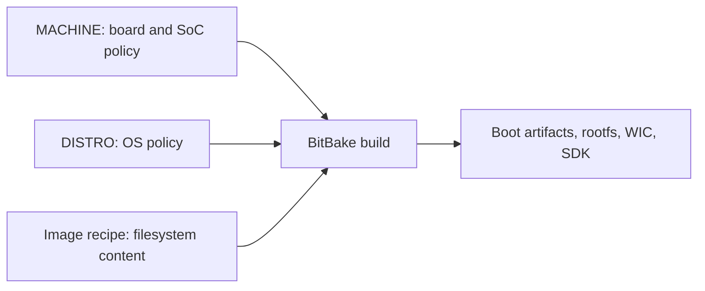

# Machines, Distros, and Image Targets

## Goal

Learn how `MACHINE`, `DISTRO`, and image recipes interact in TI SDK builds.

## The Three Axes

Every TI SDK BitBake build has at least three important selections:

- `MACHINE`: hardware target
- `DISTRO`: distribution policy
- image target: root filesystem and deployable image composition

These axes are related but not interchangeable.



## `MACHINE`

The machine usually controls:

- SoC tuning
- kernel provider details
- kernel device trees
- U-Boot configuration
- SPL/TPL requirements
- boot firmware dependencies
- WIC kickstart selection
- serial console settings
- storage and boot media assumptions

Do not invent machine names. Start from the documented EVM machine. For a custom board, create a product-owned machine only when you understand what the EVM machine contributes.

## `DISTRO`

The distro usually controls:

- package format
- init system
- libc policy
- image features
- debug and development package policy
- preferred providers
- security flags
- license policy
- SDK generation behavior

In TI SDKs, Arago distro policy is part of the validated stack. Replacing it with another distro is possible in advanced product builds, but it should be treated as integration work, not a small option change.

## Image Targets

Image recipes control what goes into the root filesystem and which image artifacts are produced. A TI SDK release may provide images aimed at:

- minimal boot
- base development
- default SDK demonstration
- graphics/multimedia demos
- RT Linux validation
- installer or flashing workflows

Read the image recipe and package groups. Do not judge an image only by its name.

## Example Inspection

```bash
bitbake-layers show-recipes '*image*'
bitbake -e tisdk-default-image | grep '^IMAGE_INSTALL='
bitbake -e tisdk-default-image | grep '^IMAGE_FSTYPES='
bitbake -e tisdk-default-image | grep '^WKS_FILE'
```

This shows what the image installs and what disk image formats it generates.

## Custom Machine Strategy

A custom Sitara board should usually have:

- a custom machine file
- custom kernel DTB selection
- custom U-Boot configuration when needed
- custom WIC layout when storage changes
- product-owned firmware dependencies
- clear inheritance from or comparison against the closest EVM

Avoid burying board-specific behavior in `local.conf`. A board is a machine, not a developer preference.

## Custom Image Strategy

A product should usually have:

- product image recipe
- product package groups
- product service enablement
- product debug/development image variant
- product production image variant

Do not keep product package selection only in `IMAGE_INSTALL:append` inside `local.conf`. That does not scale to CI, releases, or audits.

## Common Mistakes

- Using an EVM machine name for a product forever.
- Creating a custom machine before understanding the EVM machine.
- Putting board policy in an image recipe.
- Putting product application policy in a machine file.
- Changing image content to solve a bootloader or kernel artifact issue.
- Assuming `tisdk-default-image` is a production image.

## Related Topics

- [Machine and Distro Configuration](../yocto-openembedded/machine-and-distro-configuration.md)
- [SDK Customization for Products](sdk-customization-for-products.md)
- [Custom Sitara Board Bring-Up](custom-sitara-board-bring-up.md)
