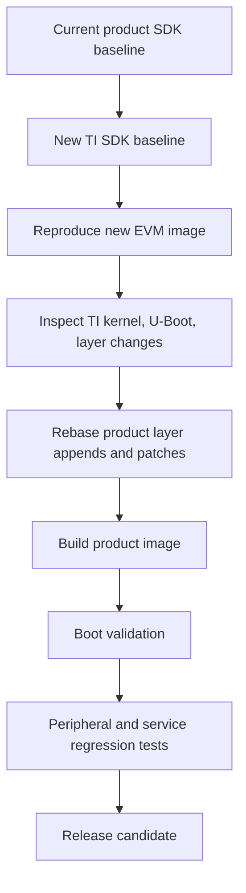

# Release Engineering and SDK Upgrades

## Goal

Make TI SDK based product builds reproducible, auditable, and upgradeable.

## What To Version

Version:

- TI SDK release
- layer revisions
- product layer revisions
- build configuration templates
- image target names
- machine names
- kernel and U-Boot providers
- firmware versions
- generated artifact checksums
- release manifests
- known deviations from TI baseline

Do not rely on "the build server has the right checkout".

## Manifest Strategy

A release should include:

- source manifest or repository lock file
- build configuration summary
- image manifest
- license manifest
- package list
- boot artifact checksums
- rootfs checksum
- WIC checksum
- SDK/toolchain checksum if produced
- build logs or CI links

## Upgrade Workflow

Never upgrade by blindly replacing layer directories. First reproduce the new vendor baseline, then reapply product-owned changes.

## Patch Ownership During Upgrades

Classify every product patch:

- already upstream in new SDK
- still required unchanged
- required but needs rework
- obsolete because hardware/software changed
- should be submitted upstream or to vendor

Do this for:

- kernel patches
- U-Boot patches
- DTS changes
- recipe appends
- package versions
- firmware changes

## CI Strategy

CI should at least:

- initialize layers from a pinned manifest
- use controlled `DL_DIR` and `SSTATE_DIR`
- build the product image
- build kernel and U-Boot explicitly when useful
- export deploy artifacts
- archive manifests and license output
- run static metadata checks
- run boot smoke tests when hardware is available

Hardware-in-the-loop tests are especially valuable for boot artifact changes.

## Reproducibility Notes

For reproducibility:

- pin source revisions
- mirror downloads
- control host environment
- record build container image or host package set
- avoid manual post-processing
- keep product changes in layers
- archive artifacts with checksums
- avoid time-dependent version strings unless deliberate

## Common Mistakes

- Updating TI layers without updating release documentation assumptions.
- Carrying patches forward without checking if they are obsolete.
- Treating successful compilation as a release candidate.
- Not archiving boot artifacts separately from rootfs artifacts.
- Releasing an image that cannot be traced to layer revisions.
- Making manual changes to a generated image after BitBake completes.

## Related Topics

- [CI, Hash Equivalence, and Shared State](../yocto-openembedded/ci-hash-equivalence-and-sstate.md)
- [Licensing, CVE, and SBOM Workflows](../yocto-openembedded/licensing-cve-and-sbom.md)
- [SDK Customization for Products](sdk-customization-for-products.md)
