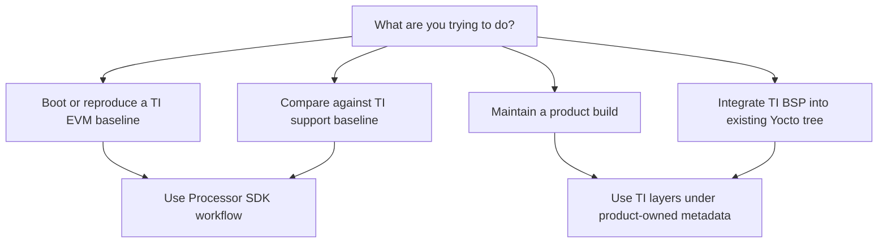

# Processor SDK Build System vs TI Yocto Layers

## Goal

Understand the difference between using TI Processor SDK Linux as a complete vendor build workflow and using TI-provided Yocto/OpenEmbedded layers as metadata inside your own product build.

## The Short Version

The **Processor SDK build system** is the release-integrated workflow. It tells you which repositories, branches, layers, machine names, distro settings, image targets, firmware, and deployment steps belong together.

The **TI Yocto layers** are metadata inputs. They contain recipes, machine files, classes, configuration, and appends used by BitBake. They can be part of the Processor SDK workflow, but they are not the entire SDK.

## What The Processor SDK Workflow Owns

The Processor SDK workflow owns the top-level release experience:

- release documentation
- supported host setup
- `oe-layersetup` configuration
- layer revision pinning
- EVM validation path
- prebuilt images
- image target recommendations
- flashing and boot instructions
- SDK/toolchain installer generation
- TI support context

When you say "I built Processor SDK Linux", you usually mean you followed TI's documented setup and built one of TI's supported image targets for a supported `MACHINE`.

## What TI Yocto Layers Own

TI Yocto layers own metadata:

- machine configuration
- BSP recipes
- kernel recipes and appends
- U-Boot recipes and appends
- firmware recipes
- image recipes
- package groups
- distro policy through Arago layers
- TI-specific classes and helper metadata

When you say "I use TI Yocto layers", you usually mean your product build includes TI metadata as dependencies, but your own layer may own product image content, application recipes, distro policy, and release process.

## Comparison

| Question | Processor SDK workflow | TI Yocto layers |
| --- | --- | --- |
| Main purpose | Reproduce TI's validated release | Provide build metadata |
| Top-level owner | TI SDK release docs and setup | Your build or a layer manifest |
| Best first use | EVM baseline and bring-up | Product integration |
| Includes prebuilt artifacts | Yes | Not inherently |
| Includes flashing instructions | Yes | Not inherently |
| Supports product layer ownership | Yes, but you add it | Yes, this is the normal long-term model |
| Failure mode | Version/documentation mismatch | Metadata/provider/layer conflict |

## Example: EVM Baseline

For a new AM62x project, a sane early workflow is:

```text
Processor SDK docs
-> initialize documented release config
-> build documented EVM image
-> flash SD card
-> boot EVM
-> record boot log and artifact versions
```

This is a Processor SDK workflow. It proves that host setup, layer revisions, image target, boot artifacts, and board instructions are coherent.

## Example: Product Build

Later, the product workflow should look more like:

```text
company manifest
-> poky/OE layers
-> TI BSP layers
-> company distro layer
-> company product BSP layer
-> company application layer
-> CI build and release artifacts
```

This is a Yocto product workflow that uses TI layers. The TI SDK release is still important, but the product build now has its own ownership boundary.

## Decision Tree



## Product Ownership Rule

Do not make long-lived product changes directly inside vendor layers. Use a product layer for:

- application recipes
- image customization
- package groups
- kernel config fragments
- kernel patches
- U-Boot config fragments or patches
- custom machine configuration
- custom distro policy
- board-specific firmware packaging

Vendor layers should remain easy to replace during SDK upgrades. If your product depends on a vendor-layer edit that is not represented in your own layer or patch queue, your upgrade path is fragile.

## When Direct TI Layer Use Is Risky

Using TI layers directly without the Processor SDK release context is risky when:

- you do not know which branch combination is validated
- you are copying machine names from old docs
- firmware and bootloader revisions are not aligned
- you are mixing Arago and non-Arago distro policy without inspecting providers
- you are asking TI for help but cannot state the SDK baseline

The fix is not always to abandon your product tree. The fix is to reproduce the matching SDK baseline once, then compare your product tree against it.

## Common Mistakes

- Saying "Yocto from TI" when you mean the complete Processor SDK workflow.
- Saying "Processor SDK" when you only cloned one TI layer.
- Assuming the SDK installer layout and the BitBake deploy layout are the same thing.
- Treating prebuilt binaries as proof that your source build is equivalent.
- Editing `conf/local.conf` forever instead of moving policy into product metadata.

## Related Topics

- [SDK Overview and Release Model](sdk-overview-and-release-model.md)
- [TI Yocto and Arago Build Flow](ti-yocto-arago-build-flow.md)
- [SDK Customization for Products](sdk-customization-for-products.md)
