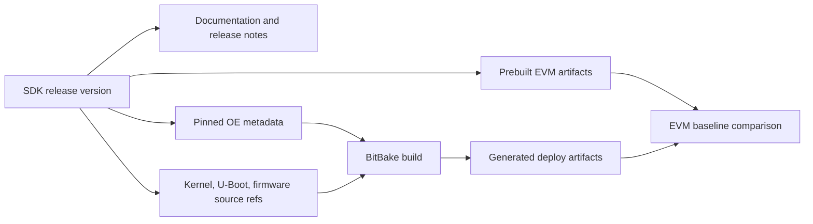

# SDK Overview and Release Model

## Goal

Learn what a TI Processor SDK Linux release is, what it promises, and how it should constrain your build work.

## What A Processor SDK Release Contains

A Processor SDK release is a validated bundle around one or more TI processor families and EVMs. The exact contents vary by processor and SDK version, but the release normally includes:

- release notes
- getting-started documentation
- prebuilt boot artifacts and images
- Yocto/OpenEmbedded setup instructions
- pinned layer revisions
- TI kernel and U-Boot revisions
- firmware packages
- root filesystem images
- SDK/toolchain installers
- example applications and board demos
- known issues and feature support tables

The important point is that the release is a compatibility statement. TI has validated a specific combination of bootloader, kernel, device trees, firmware, distro policy, image content, and board documentation.

## Why The Release Boundary Matters

In embedded Linux, many failures come from mixing pieces that were never validated together:

- U-Boot from one release with DTBs from another release
- kernel from one SDK with firmware from a different SDK
- documentation for a newer board revision applied to an older release
- Arago image recipes from one branch with `meta-ti` from another branch
- a product layer that silently overrides a provider selected by TI

Treat the SDK release like a baseline contract. Before customizing, write down:

- SDK version
- processor family
- EVM or custom board
- selected `MACHINE`
- selected `DISTRO`
- image target
- kernel provider and revision
- U-Boot provider and revision
- firmware package versions
- host OS used for the build

## EVM First, Product Second

For Sitara-style product work, the EVM is the reference baseline. Do not start by debugging the product board and the build system at the same time.

Recommended sequence:

1. Boot TI's prebuilt EVM image.
2. Build the same EVM image from source.
3. Compare deployed artifacts from prebuilt and source builds.
4. Make one small controlled change and verify it appears on target.
5. Only then move toward product-board machine and device-tree changes.

This sequence gives you a known-good reference for boot ROM behavior, boot media layout, U-Boot handoff, kernel boot, firmware loading, and root filesystem content.

## SDK Release Inputs And Outputs

## What To Read First

For each SDK release, read in this order:

1. Release notes.
2. Supported platforms table.
3. Host setup instructions.
4. EVM boot and flashing instructions.
5. Yocto build instructions.
6. Kernel and U-Boot customization notes.
7. Known issues.

Known issues are not optional reading. They often explain build failures, broken peripherals, unsupported boot modes, or release-specific workarounds.

## Practical Checklist

Before calling a build failure "Yocto broken", answer:

- Am I using the documented SDK branch/tag/config?
- Is my host OS inside the documented support range?
- Did I initialize the exact release config?
- Is the `MACHINE` copied from TI docs, not guessed?
- Did I change `DISTRO`, preferred providers, or layer priority?
- Am I building a supported image target for this machine?
- Can the prebuilt image boot on the EVM?

If the answer to any of these is unknown, resolve it before modifying metadata.

## Common Mistakes

- Treating Processor SDK as just a tarball of source code.
- Searching random branch names instead of using the release's setup config.
- Debugging a product board before proving the EVM baseline.
- Keeping local edits inside cloned TI layers without recording them as product patches.
- Ignoring known issues because the image built successfully.
- Assuming every TI processor family uses identical boot artifacts.

## Related Topics

- [Processor SDK Build System vs TI Yocto Layers](sdk-build-system-vs-ti-yocto-layers.md)
- [TI Yocto and Arago Build Flow](ti-yocto-arago-build-flow.md)
- [Release Engineering and SDK Upgrades](release-engineering-and-sdk-upgrades.md)
