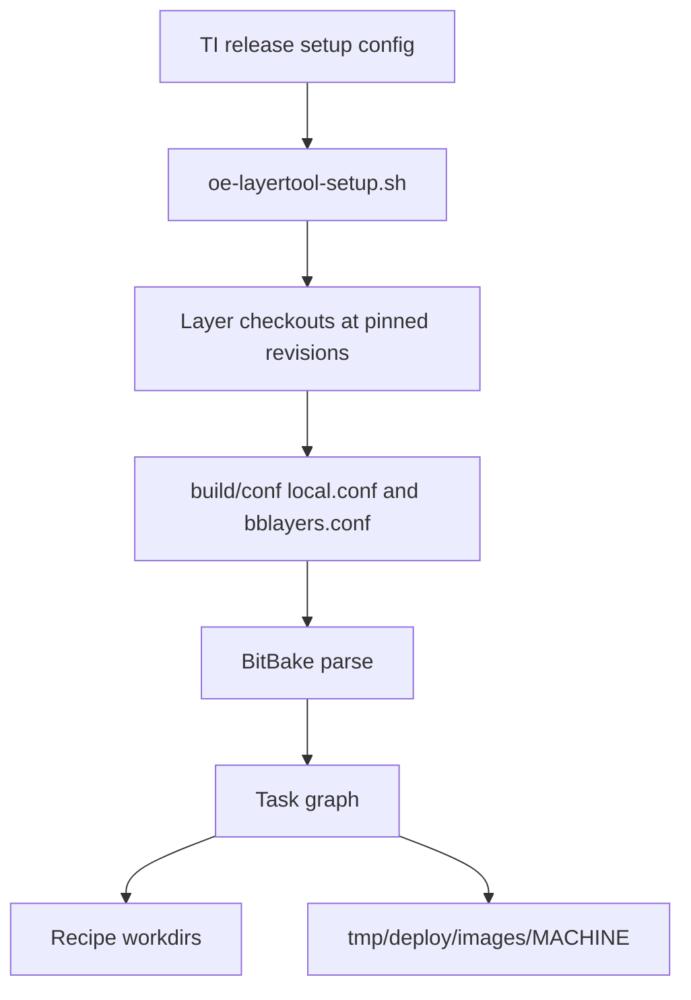

# TI Yocto and Arago Build Flow

## Goal

Understand how TI SDK source builds use OpenEmbedded metadata, Arago distribution policy, TI BSP layers, and BitBake.

## What Arago Is

Arago is TI's OpenEmbedded-based distribution and metadata environment. In Processor SDK Linux builds, Arago layers typically provide TI distribution policy, package groups, image composition, and integration metadata around TI BSP support.

Conceptually:

```text
OpenEmbedded core
-> common community layers
-> TI BSP layers
-> Arago distro/image policy
-> optional product layers
-> BitBake build
```

## Setup Tooling

TI SDK documentation commonly points to `oe-layersetup` and `oe-layertool-setup.sh`. The purpose is to clone the correct layer repositories and check out the correct revisions for a release.

The setup tool is not the build system itself. It prepares the metadata graph. BitBake performs the actual build.

## Build Flow



## What `MACHINE` Selects

`MACHINE` selects board/SoC-specific build policy:

- tuning
- kernel device trees
- bootloader configuration
- firmware requirements
- image dependencies
- WIC layout
- deploy artifact naming

For TI SDK work, use the machine name documented for your EVM first. A custom product board usually starts from the closest EVM machine and then becomes a product-owned machine.

## What `DISTRO` Selects

`DISTRO` selects distribution policy:

- init system
- package manager behavior
- image features
- preferred providers
- compiler and libc policy
- security and debug options
- SDK behavior

Changing `DISTRO` can alter far more than user-space package selection. It can affect providers, image content, and QA policy.

## Image Targets

TI SDKs often provide image targets such as base images, default images, demo images, or filesystem-specific targets. The names are release-specific. Read the selected SDK docs and build the documented target first.

Questions to answer for each image:

- Is this intended for demos, development, production, or minimal boot?
- Does it include graphics, networking, debug tools, or examples?
- Does it generate a WIC image?
- Does it include firmware and boot artifacts?
- Does it depend on package feeds?

## Inspecting The Active Build

Useful commands:

```bash
bitbake-layers show-layers
bitbake-layers show-appends
bitbake-layers show-recipes virtual/kernel
bitbake-layers show-recipes virtual/bootloader
bitbake -e <image> | less
bitbake -g <image>
```

Use `bitbake -e` to inspect final variable values. Use `bitbake-layers` to understand where metadata came from.

## Where Product Layers Fit

A product layer should sit above vendor layers and own product changes:

```text
meta-ti / meta-arago / community layers
-> meta-company-bsp
-> meta-company-distro
-> meta-company-apps
```

Layer priority should be deliberate. Do not use high priority as a substitute for understanding provider selection.

## Common Mistakes

- Treating `oe-layersetup` output as an editable product workspace with no patch plan.
- Changing `MACHINE` and assuming only the DTB changes.
- Changing `DISTRO` and assuming only package selection changes.
- Adding packages in `local.conf` instead of owning image policy in a layer.
- Building a random image target that is not documented for the selected SDK.

## Related Topics

- [Yocto and OpenEmbedded](../yocto-openembedded/index.md)
- [Machines, Distros, and Image Targets](machines-distros-and-image-targets.md)
- [SDK Customization for Products](sdk-customization-for-products.md)
