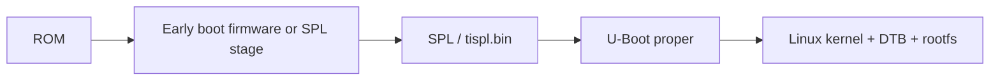

# U-Boot Integration

## Goal

Learn how the TI SDK builds, configures, patches, and deploys U-Boot and related early boot artifacts.

## What The U-Boot Recipe Wraps

The U-Boot recipe wraps the U-Boot build system. BitBake fetches source, applies patches, selects configuration, runs the U-Boot build, and deploys boot artifacts.

Typical outputs may include:

- SPL-related images
- `tiboot3.bin`
- `tispl.bin`
- `u-boot.img`
- environment files
- boot scripts
- configuration metadata

Exact outputs depend on SoC family, boot flow, and SDK release.

## Provider Selection

Inspect:

```bash
bitbake-layers show-recipes virtual/bootloader
bitbake -e virtual/bootloader | grep '^PREFERRED_PROVIDER_virtual/bootloader'
bitbake -e virtual/bootloader | grep '^UBOOT_MACHINE'
```

Some TI releases use specific recipe names and variables. Always inspect final values instead of assuming from upstream U-Boot.

## SPL, TPL, And U-Boot Proper

On many TI systems, bootloader work involves multiple stages:



The job of each stage is constrained by SRAM size, boot media, security state, clocks, DDR initialization, and firmware handoff.

## Configuration Changes

Product U-Boot changes may involve:

- defconfig changes
- Kconfig options
- board files
- device tree changes
- environment defaults
- boot command policy
- boot target order
- storage driver enablement
- Ethernet or USB support for recovery

Prefer product-owned patches and config fragments where supported by the release.

## Environment Policy

U-Boot environment may come from:

- compiled default environment
- text-based environment source
- boot scripts
- persistent environment in flash/eMMC
- distro boot variables
- user changes made at the U-Boot prompt

For products, decide whether persistent environment is allowed. A field device with stale environment can ignore new boot policy even after a software update.

Useful commands:

```text
printenv
env default -a
saveenv
version
bdinfo
```

Use `saveenv` carefully. It changes persistent target state.

## Boot Scripts And FIT Images

Some TI workflows use boot scripts, extlinux files, or FIT images. Find the active mechanism before editing random environment variables.

Questions:

- Does U-Boot load `boot.scr`?
- Does it use `extlinux.conf`?
- Does it load a FIT image?
- Where is the kernel command line constructed?
- Which partition and filesystem does U-Boot read?
- Are overlays applied by U-Boot?

## Rebuilding Only U-Boot

Common commands:

```bash
bitbake virtual/bootloader
bitbake virtual/bootloader -c clean
bitbake virtual/bootloader -c compile -f
```

Then inspect deploy output and make sure the boot media actually receives the new artifacts.

## Common Mistakes

- Rebuilding U-Boot but not rewriting the boot partition.
- Booting from eMMC while updating SD-card files.
- Changing Linux DT only when U-Boot also needs a DT change.
- Forgetting persistent environment overrides compiled defaults.
- Mixing secure and non-secure boot artifacts.
- Assuming `u-boot.img` alone is enough on systems requiring earlier boot binaries.

## Related Topics

- [U-Boot Build System](../u-boot/index.md)
- [Boot Artifact Pipeline](boot-artifact-pipeline.md)
- [Deployment and Flashing](deployment-and-flashing.md)
