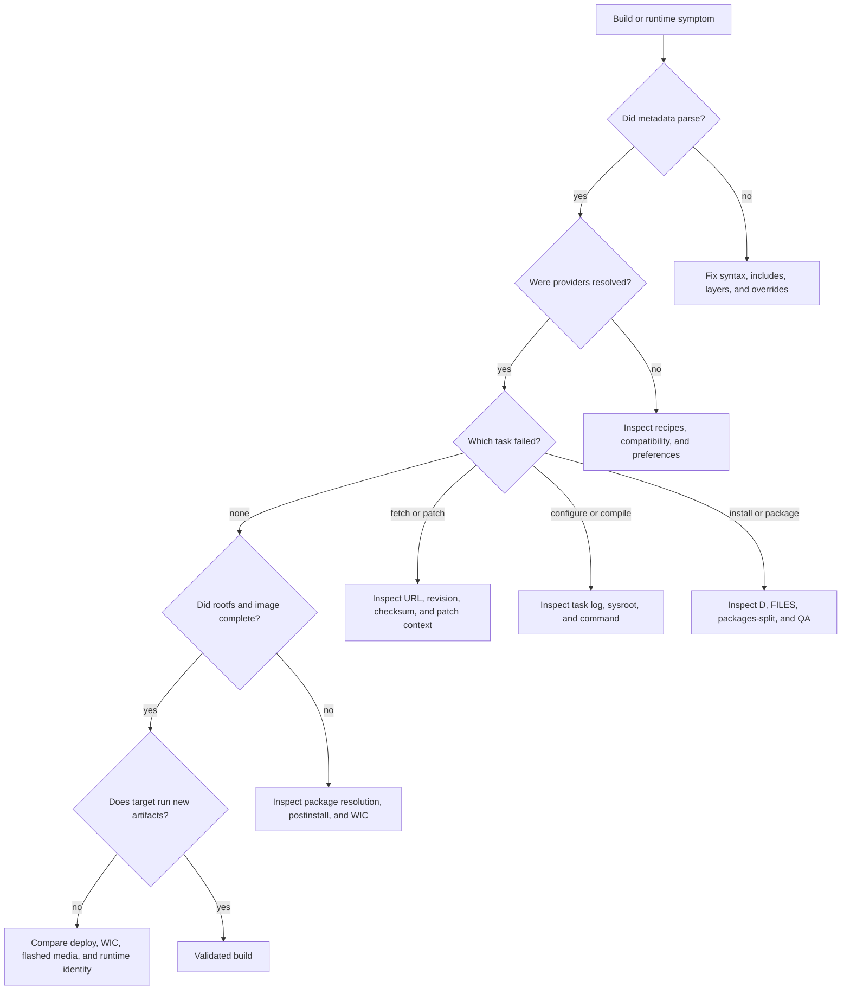

# Debugging BitBake Builds

## What Problem Does This Solve?

BitBake failures can occur during parsing, provider selection, fetching, patching, configuration, compilation, installation, packaging, rootfs construction, image generation, deployment, or target boot. Efficient debugging starts by identifying the layer and task that failed.

## Core Concepts

- parse error
- provider selection
- expanded environment
- task log
- generated run script
- dependency graph
- signature
- package data
- rootfs failure
- deployment mismatch

## Debugging Mental Model

```text
classify failure
-> inspect final metadata
-> inspect exact task log/run script
-> inspect task inputs/workdir
-> fix maintained metadata/source
-> rebuild minimum scope
-> validate full image/runtime
```

## Failure-Mode Matrix



| Symptom | Layer | First Checks |
| --- | --- | --- |
| metadata syntax error | parsing | file/line, override syntax, include path |
| nothing provides item | providers | recipe availability, layer, `PROVIDES`, preferences |
| append not applied | layers | filename matching, active layer, selected recipe version |
| fetch fails | source | URL, revision, branch, credentials, mirrors, checksums |
| patch fails | source/patch | patch order, source revision, `${S}`, patch context |
| configure fails | build system | sysroot, dependencies, cross detection, feature options |
| compile fails | source/build | first compiler error, command, headers/libs, host contamination |
| install fails | recipe | `${D}`, paths, permissions, parallel races |
| QA/package fails | packaging | `FILES`, dependencies, RPATH, ownership, unshipped files |
| rootfs fails | image/package | package name, architecture, conflicts, postinstall |
| image builds but board unchanged | deployment | deploy/WIC checksums, boot source, flashed media |

## Parse Failures

Parse errors happen before task execution.

Check:

- exact file and line
- unmatched quotes
- obsolete override syntax
- missing `require` target
- invalid Python expansion
- missing layer dependency

Use:

```sh
bitbake-layers show-layers
bitbake-layers show-appends
```

## Inspecting Final Metadata

```sh
bitbake -e <recipe>
```

Filter variables:

```sh
bitbake -e <recipe> | grep '^SRC_URI='
bitbake -e <recipe> | grep '^DEPENDS='
bitbake -e <recipe> | grep '^PACKAGECONFIG='
bitbake -e <recipe> | grep '^WORKDIR='
```

The variable history in `bitbake -e` can show which files and operations changed a value.

## Provider Debugging

```sh
bitbake-layers show-recipes <name>
bitbake-layers show-recipes virtual/kernel
bitbake -e virtual/kernel | grep -E '^(PN|PV|PREFERRED_PROVIDER|PREFERRED_VERSION)'
```

Questions:

- is provider layer active?
- is recipe compatible with machine?
- is version masked?
- is a preference scoped incorrectly?
- does the provider actually declare the capability?

## Fetch Failures

Read `log.do_fetch`.

Check:

- URL/protocol
- branch name
- fixed revision exists
- private credentials/SSH setup
- checksum
- proxy/mirror policy
- network isolation

Do not solve a missing revision by switching release builds to a floating branch head.

## Patch Failures

```sh
bitbake -c patch <recipe>
bitbake -e <recipe> | grep '^S='
```

Inspect:

- source revision
- patch ordering in `SRC_URI`
- path strip level
- whether vendor already applied equivalent change
- whether patch modifies generated files

Rebase patches as clean commits against the selected source.

## Configure Failures

Check:

- `log.do_configure`
- configure cache/results
- `${S}` and `${B}`
- recipe sysroot
- `DEPENDS`
- `PACKAGECONFIG`
- cross-compilation detection

Common issue: upstream project runs a target binary during configure. It needs a cross-aware check or native helper strategy.

## Compile Failures

Start with the first real compiler/linker error, not the last cascade.

Check generated command in log/run script:

- compiler target
- `--sysroot`
- include paths
- library paths
- generated headers
- parallel race
- warning-as-error behavior

Use `bitbake -c devshell <recipe>` for focused reproduction.

## Install And Packaging Failures

Inspect `${D}`:

```sh
bitbake -e <recipe> | grep '^D='
```

Check:

- files installed to target paths
- no host absolute paths
- correct modes/owners
- `FILES` assignments
- empty/missing package
- runtime dependencies
- RPATH and stripped/debug behavior

`installed-vs-shipped` QA means a file exists in `${D}` but no output package owns it.

## Rootfs Failures

Read image `log.do_rootfs`.

Check:

- requested package exists
- package architecture compatible
- dependency conflicts
- provider alternatives
- package feed metadata
- post-install scripts
- read-only-rootfs constraints

Use the image manifest from successful builds to compare composition.

## Dependency Graphs

```sh
bitbake -g <target>
```

Generated graph files can answer:

- why is a recipe being built?
- what depends on it?
- which provider is selected?
- why did a change trigger broad rebuilding?

Large graphs need filtering or graph tools.

## Signature Debugging

When tasks rebuild unexpectedly or fail to rebuild, inspect task signatures and metadata inputs.

Tools and exact workflows vary by release, but concepts remain:

- compare signatures
- identify differing variables/dependencies
- verify metadata input participates in task hash
- check sstate reuse

Avoid excluding variables from signatures merely to improve cache hits unless they truly cannot affect output.

## Debugging Package Inclusion

If a package is absent:

1. Does recipe build?
2. Which package owns required file?
3. Is package requested by image/package group?
4. Is it excluded or incompatible?
5. Does image manifest include it?
6. Is final rootfs/WIC current?

Do not search only for recipe name.

## Deployment Debugging

Build success is not runtime proof.

Compare:

- versioned deploy files
- symlink targets
- WIC contents
- flashed media checksums
- U-Boot serial version/environment
- kernel `uname -a`
- runtime DTB
- rootfs release manifest

## Logging A Reproducible Failure

Capture:

- target command
- machine/distro
- layer revisions
- selected provider/version
- failing task
- full task log
- relevant `bitbake -e` variables
- source revision
- whether sstate/mirrors were used

## Cleaning Strategy

Prefer minimal scope:

1. Fix metadata/source.
2. Let signatures rerun tasks.
3. Force one task only for diagnosis.
4. Use `clean` if workdir state is suspect.
5. Use `cleansstate` when task output must be rebuilt.
6. Use `cleanall` only when downloads themselves must be removed.

## Worked Example: Nothing Provides A Package

Rootfs reports:

```text
nothing provides product-agent-cli
```

Check:

```sh
bitbake-layers show-recipes product-agent
bitbake -e product-agent | grep '^PACKAGES='
```

If package is actually named `product-agent-tools`, fix image/package-group package name. Do not rename the recipe blindly.

## Worked Example: Host Header Contamination

Compile log contains `/usr/include/...` before recipe sysroot paths.

Investigate upstream build commands and class/toolchain integration. Fix the build system to honor supplied compiler/sysroot; do not add the host package as an undocumented build prerequisite.

## Worked Example: Why Did A Recipe Build?

```sh
bitbake -g product-image
grep product-recipe pn-depends.dot
```

Use graph output to identify the dependency chain, then correct the owning package group/dependency rather than masking the recipe.

## Common Mistakes

- Deleting all caches before reading logs.
- Debugging recipe text instead of final expanded metadata.
- Fixing task order instead of declaring dependency.
- Ignoring workspace-layer overrides.
- Treating package and recipe names as identical.
- Stopping after image build without verifying deployed runtime.
- Reporting only the last line of a task failure.

## Master Checklist

- Parse, provider, task, package, image, or deployment failure?
- Which exact recipe/provider/version?
- Which task failed?
- What is `${WORKDIR}`?
- What does first error in task log say?
- What generated command ran?
- What are final relevant variables?
- Are dependencies correctly modeled?
- Is sstate involved?
- Does maintained metadata contain the fix?
- Does a clean image/runtime validate it?

## Related Topics

- [Tasks and Workdirs](tasks-and-workdirs.md)
- [Recipes](recipes.md)
- [Layers](layers.md)
- [Reproducibility, Caches, and Mirrors](reproducibility-caches-and-mirrors.md)

## References

- BitBake User Manual
- Yocto Project Reference Manual
- Yocto Project Development Tasks Manual
