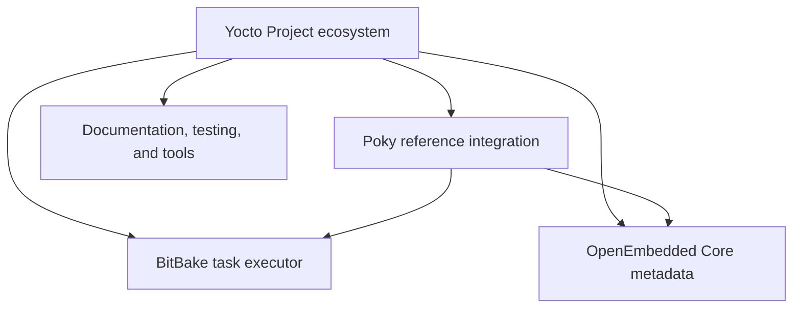
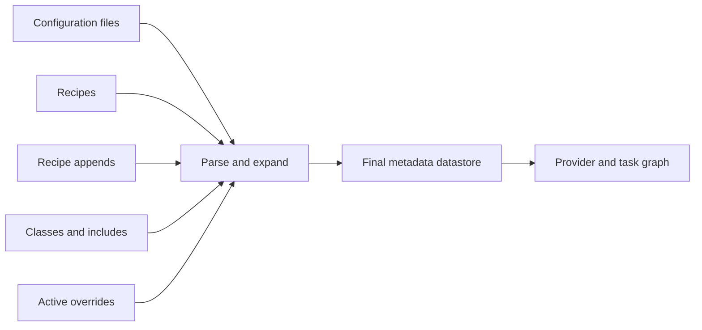
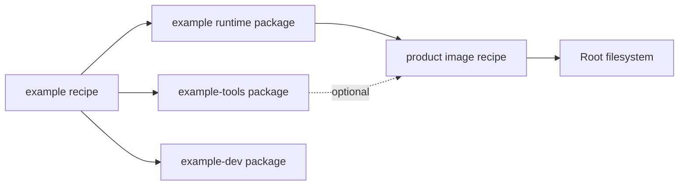
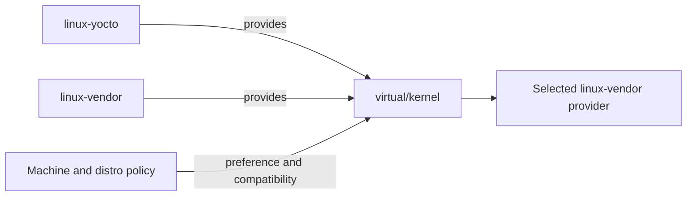

# Yocto, OpenEmbedded, and BitBake Mental Model

## What Problem Does This Solve?

Yocto/OpenEmbedded builds complete Linux distributions from metadata. Its behavior can initially seem indirect because you do not usually run a compiler or image-generation command yourself. You describe policy, dependencies, sources, tasks, packages, machines, and images; BitBake parses that metadata and constructs the commands and dependency graph.

This page establishes the mental model needed before studying individual recipes, layers, tasks, images, kernel integration, or TI Processor SDK Linux.

## Core Concepts

- Yocto Project
- OpenEmbedded
- BitBake
- Poky
- metadata
- layer
- recipe
- append
- class
- configuration
- task
- provider
- package
- image
- task graph
- signature
- shared state
- deploy artifact

## The Four Names You Must Separate



### Yocto Project

The Yocto Project is the broader project and ecosystem for creating custom Linux distributions. It includes documentation, reference metadata, tools, testing infrastructure, release processes, and conventions.

Yocto is not one build command and not one Linux distribution.

### OpenEmbedded

OpenEmbedded provides the metadata model and core metadata used to build software and complete Linux systems.

Important parts include:

- OpenEmbedded Core, commonly called OE-Core
- recipes
- classes
- machine and distro configuration
- packaging and image-generation infrastructure

### BitBake

BitBake is the task executor and metadata interpreter.

It:

- parses configuration and metadata
- expands variables and overrides
- selects providers
- creates task dependency graphs
- computes task signatures
- executes tasks
- restores reusable task output from shared state

BitBake is conceptually closer to a metadata-driven task scheduler than to GNU Make.

### Poky

Poky is a reference integration of BitBake, OE-Core, reference layers, and configuration. It is useful for learning and as a known baseline.

Poky is not normally the final product distribution. Product builds usually add vendor BSP layers and one or more product layers.

## The Fundamental Mental Model

```text
metadata and configuration
-> parse and expand
-> select recipes/providers/versions
-> create task graph
-> calculate task signatures
-> reuse valid shared-state output
-> execute remaining tasks
-> create packages
-> assemble root filesystem
-> create bootable images and deploy artifacts
```

The build is driven by final expanded metadata, not by the text of one recipe in isolation.



## Metadata Inputs

BitBake combines several metadata types.

### Configuration Files

Files ending in `.conf` define build-wide, distro, machine, and layer configuration.

Common examples:

```text
conf/local.conf
conf/bblayers.conf
conf/machine/<machine>.conf
conf/distro/<distro>.conf
conf/layer.conf
```

### Recipes

Files ending in `.bb` describe how to fetch, configure, compile, install, package, and license one software component or image.

Examples:

```text
busybox_1.36.1.bb
linux-yocto_6.6.bb
u-boot_2024.01.bb
core-image-minimal.bb
```

### Recipe Appends

Files ending in `.bbappend` extend or modify recipes owned by another layer.

They are commonly used to add:

- patches
- configuration fragments
- device trees
- extra files
- task changes
- machine-specific behavior

### Classes

Files ending in `.bbclass` provide reusable behavior.

Examples include classes for:

- CMake
- Autotools
- kernel builds
- systemd integration
- image creation
- SDK generation
- licensing

Recipes inherit classes instead of reimplementing common task logic.

### Include Files

Files ending in `.inc` contain shared metadata included by recipes or configurations.

## Parsing Is Not Building

BitBake first parses metadata and resolves the final data model.

During parsing, it determines:

- active layers
- available recipes
- matching appends
- inherited classes
- variable values
- overrides
- preferred providers
- preferred versions
- task definitions
- dependencies

Only after parsing can BitBake create the task graph for a target.

This distinction explains why a syntax error or provider conflict can fail before any compiler runs.

## The Build Target

A command such as:

```sh
bitbake core-image-minimal
```

asks BitBake to build the target named `core-image-minimal`.

That target creates dependencies on:

- image construction tasks
- packages requested by the image
- recipes that produce those packages
- libraries and tools required by those recipes
- compiler and sysroot components
- kernel and boot artifacts where the image type requires them

One target expands into a large directed acyclic graph of tasks.

## Recipes, Packages, And Images Are Different

This distinction prevents many mistakes.

### Recipe

A recipe is build metadata.

Example recipe name:

```text
busybox
```

### Package

A recipe can emit several binary packages.

Conceptual examples:

```text
busybox
busybox-dev
busybox-dbg
busybox-src
```

The exact split depends on metadata.

### Image

An image recipe requests packages and image features, then assembles a root filesystem and image files.

Therefore:

```text
recipe name != package name != image name
```



## Providers

A dependency can request a capability rather than one exact recipe.

Examples:

```text
virtual/kernel
virtual/bootloader
virtual/libc
```

Multiple recipes may provide the same capability. Configuration selects the preferred provider.

For BSP work, always determine:

- which recipe provides `virtual/kernel`
- which recipe provides `virtual/bootloader`
- which version and source revision are selected
- whether a vendor layer overrides a reference provider

Useful inspection:

```sh
bitbake-layers show-recipes virtual/kernel
bitbake-layers show-recipes virtual/bootloader
bitbake -e virtual/kernel
```



## Task Model

Recipes contain or inherit tasks.

A typical source recipe flows through:

```text
do_fetch
-> do_unpack
-> do_patch
-> do_configure
-> do_compile
-> do_install
-> do_package
-> package writing tasks
```

This is not one shell script. Each task is separately scheduled, logged, signed, and potentially restored from shared state.

## Important Tasks

### `do_fetch`

Obtains source archives, Git repositories, patches, and local files referenced by `SRC_URI`.

### `do_unpack`

Expands fetched source into the recipe work directory.

### `do_patch`

Applies patches from metadata.

### `do_configure`

Configures the source tree, for example with CMake or Autotools.

### `do_compile`

Builds the source with the cross-compilation environment prepared by BitBake.

### `do_install`

Installs files into `${D}`, a staging destination representing the packageable target filesystem layout.

It must not install directly into the final root filesystem.

### `do_package`

Splits installed files into output packages according to package metadata.

### `do_rootfs`

Installs selected binary packages into the image root filesystem.

### Image Tasks

Image tasks transform the root filesystem and boot artifacts into formats such as:

```text
ext4
tar
wic
squashfs
cpio
```

Available formats depend on configuration and inherited image behavior.

## Task Dependencies

Task order comes from dependencies, not from file order.

Dependencies can arise from:

- recipe build dependencies
- runtime package dependencies
- explicit task dependencies
- class behavior
- image package selections
- provider relationships

Two recipes can build in parallel when the graph permits it.

## Build Dependencies Vs Runtime Dependencies

### Build Dependency

`DEPENDS` describes what a recipe needs available in its build sysroot.

Conceptual example:

```bitbake
DEPENDS += "libfoo"
```

### Runtime Dependency

`RDEPENDS` describes packages required on the target at runtime.

Conceptual example:

```bitbake
RDEPENDS:${PN} += "bash"
```

Adding a build dependency does not automatically guarantee the corresponding runtime package is installed in the final image.

## Work Directory Mental Model

Each recipe gets a work directory under `tmp/work/` whose path encodes architecture, recipe, and version information.

Conceptually:

```text
tmp/work/<tune-or-machine>/<recipe>/<version>/
```

Important areas commonly include:

```text
temp/       task logs and generated run scripts
image/      files installed into ${D}
packages-split/ package split results
recipe-sysroot/ target build dependencies
recipe-sysroot-native/ host-side build tools
```

Exact layout can vary by release and recipe class.

Never preserve product changes by editing `tmp/work`. It is generated output and can be deleted or reconstructed.

## Key Directory Variables

### `${WORKDIR}`

Recipe-specific working area.

### `${S}`

Source directory used by configure and compile tasks.

### `${B}`

Build directory. It may equal `${S}` for in-tree builds or be separate for out-of-tree builds.

### `${D}`

Destination directory populated by `do_install`.

### `${DEPLOY_DIR_IMAGE}`

Machine-specific deploy output area for final image and boot artifacts.

Inspect actual values instead of guessing:

```sh
bitbake -e <recipe> | grep '^WORKDIR='
bitbake -e <recipe> | grep '^S='
bitbake -e <recipe> | grep '^B='
bitbake -e <recipe> | grep '^D='
```

## Sysroots

Yocto does not normally compile against the host system's `/usr/include` and `/usr/lib`.

Recipe sysroots provide controlled inputs:

```text
recipe-sysroot
  target libraries and headers

recipe-sysroot-native
  host-executed tools built by Yocto
```

This separation is central to reproducible cross-compilation.

If a build accidentally finds host headers or libraries, the recipe or upstream build system is usually not respecting the supplied cross environment.

## Native, Target, And SDK Variants

The same source may be built for different contexts.

### Target

Runs on the embedded target.

### Native

Runs on the build host as part of the build.

### Nativesdk

Runs on the SDK host inside a generated SDK context.

These variants have different compilers, sysroots, and package identities.

## Signatures And Shared State

BitBake computes task signatures from relevant metadata and dependencies.

If a compatible completed task output exists in the shared-state cache, BitBake can restore it instead of executing the task again.

Conceptual flow:

```text
task inputs
-> signature
-> matching sstate object exists?
   yes: restore output
   no: execute task and populate cache
```

This is why a large image build can complete quickly after a metadata change that does not invalidate most tasks.

## Shared State Is Not The Downloads Cache

### Downloads Cache

`DL_DIR` stores fetched source material.

### Shared-State Cache

`SSTATE_DIR` stores reusable task output.

Deleting downloads forces source retrieval. Deleting sstate forces more tasks to execute. They solve different problems.

## Source-To-Image Flow

For one application:

```text
recipe metadata
-> fetch source
-> unpack and patch
-> configure and cross-compile
-> install into ${D}
-> split into packages
-> write binary packages
-> package manager installs selected package into rootfs
-> image task creates final filesystem image
```

For kernel and bootloader:

```text
provider selection
-> vendor/product patches and configuration
-> component-specific build system
-> deploy kernel/U-Boot/DTB/module artifacts
-> image or WIC integration
```


Yocto orchestrates the Linux kernel and U-Boot build systems; it does not replace their internal Kbuild/Kconfig behavior.

## Parsing, Execution, And Deployment Failures

Classify failures before debugging.

### Parse Failure

Examples:

- invalid metadata syntax
- unmatched append warning/error
- missing layer dependency
- invalid override usage

No task has run yet.

### Provider Or Dependency Failure

Examples:

- nothing provides a required item
- multiple incompatible providers
- unavailable recipe version
- package dependency cannot be resolved

### Task Failure

Examples:

- fetch fails
- patch does not apply
- compile fails
- install writes wrong paths
- packaging QA fails

Read the task log under `${WORKDIR}/temp/`.

### Rootfs Or Image Failure

Examples:

- package conflicts
- missing runtime package
- postinstall failure
- WIC layout failure

### Deployment Or Runtime Failure

The build can succeed while the board uses an old image, kernel, DTB, U-Boot stage, or environment.

## First Inspection Commands

### Show Active Layers

```sh
bitbake-layers show-layers
```

### Show Available Recipes

```sh
bitbake-layers show-recipes
bitbake-layers show-recipes <name>
```

### Show Matching Appends

```sh
bitbake-layers show-appends
```

### Inspect Final Expanded Metadata

```sh
bitbake -e <recipe>
```

This output is large. Filter it:

```sh
bitbake -e virtual/kernel | grep '^PN='
bitbake -e virtual/kernel | grep '^PV='
bitbake -e virtual/kernel | grep '^SRCREV='
bitbake -e virtual/kernel | grep '^WORKDIR='
```

### List Tasks

```sh
bitbake -c listtasks <recipe>
```

### Execute One Task

```sh
bitbake -c compile <recipe>
```

### Force A Task For Investigation

```sh
bitbake -f -c compile <recipe>
```

Use forcing as a diagnostic tool, not as a permanent build workflow.

### Generate Dependency Graphs

```sh
bitbake -g <target>
```

This generates graph data that helps inspect recipe and task dependencies.

## Cleaning Commands And Their Meaning

### Re-run From A Task

```sh
bitbake -f -c compile <recipe>
```

### Clean Recipe Output

```sh
bitbake -c clean <recipe>
```

### Remove Work And Shared-State Result

```sh
bitbake -c cleansstate <recipe>
```

### Remove Downloads Too

```sh
bitbake -c cleanall <recipe>
```

`cleanall` is rarely the first correct debugging action. Fetch failures or shared-cache issues should be understood before deleting broad caches.

## Minimal First Build Exercise

After initializing a supported build environment:

```sh
bitbake-layers show-layers
bitbake core-image-minimal
```

Then inspect:

```sh
find tmp/deploy/images -maxdepth 3 -type f
bitbake -e core-image-minimal | grep '^MACHINE='
bitbake -e virtual/kernel | grep -E '^(PN|PV|SRCREV|WORKDIR)='
bitbake -c listtasks busybox
```

Do not stop at "the image built." Map:

- active layers
- machine
- distro
- kernel provider
- bootloader provider
- image recipe
- package manager
- deployed image files

## Embedded BSP Example

A simplified product build may look like:

```text
OE-Core
+ vendor BSP layer
+ product layer
+ selected MACHINE
+ selected DISTRO
+ product image recipe
-> vendor kernel provider
-> vendor U-Boot provider
-> product patches/configuration
-> rootfs packages
-> bootable SD/eMMC/WIC image
```

The product layer should own product-specific policy and changes. Generated files under `tmp/` should own nothing.

## Additional Worked Example: Trace One File Into An Image

Suppose `/usr/bin/product-agent` must appear in `product-image`.

Trace it in this order:

```text
source file
-> product-agent recipe do_compile
-> do_install places ${D}${bindir}/product-agent
-> FILES:${PN} assigns it to product-agent package
-> packagegroup-product-base RDEPENDS on product-agent
-> product-image installs package group
-> do_rootfs installs product-agent
-> WIC/image task includes rootfs
```

Commands:

```sh
bitbake product-agent
bitbake -e product-agent | grep -E '^(D|PACKAGES|FILES:product-agent)='
bitbake product-image
grep product-agent tmp/deploy/images/${MACHINE}/*.manifest
```

This same tracing method works for libraries, services, firmware, modules, and configuration files.

## Common Misconceptions

### "A Recipe Is A Makefile"

A recipe is metadata that contributes tasks and variables. Much task behavior comes from inherited classes.

### "BitBake Builds Recipes In File Order"

BitBake follows the dependency graph.

### "If The Recipe Built, Its Package Is In The Image"

Building a recipe and installing its output package into an image are separate decisions.

### "The Recipe Text Shows The Final Variable Value"

Configuration, overrides, appends, classes, and operators can change it. Inspect `bitbake -e`.

### "Cleaning Everything Is The Best Fix"

Broad cleaning destroys evidence and wastes time. Read the failing task log and understand signatures first.

### "Yocto Replaces Kernel And U-Boot Build Knowledge"

Yocto invokes and packages those component build systems. You still need Kconfig, Kbuild, U-Boot artifact, and board boot-flow knowledge.

## Failure-Classification Checklist

- Did parsing complete?
- Which target was requested?
- Which provider was selected?
- Which task failed?
- What is the recipe `${WORKDIR}`?
- What does the task log say?
- Was output restored from sstate or executed?
- Did packaging succeed?
- Was the package selected into the image?
- Which artifact was deployed?
- Is the board actually running that artifact?

## Completion Criteria

You understand the mental model when you can explain:

- the difference between Yocto, OpenEmbedded, BitBake, and Poky
- how layers, recipes, appends, classes, and configuration combine
- why parsing precedes task execution
- how a target becomes a task graph
- the difference between recipes, packages, and images
- the difference between build and runtime dependencies
- the purpose of `${WORKDIR}`, `${S}`, `${B}`, and `${D}`
- the difference between target and native sysroots
- how signatures and sstate avoid unnecessary execution
- how source becomes a package and then part of an image
- where to inspect final metadata, task logs, and deploy artifacts

## Related Topics

- [Yocto and OpenEmbedded Overview](index.md)
- [BSP Artifact Flow and Provenance](../bsp-integration/artifact-flow-and-provenance.md)
- [Linux Kernel Build System](../linux-kernel/index.md)
- [U-Boot Build System](../u-boot/index.md)

## References

- Yocto Project Overview and Concepts Manual
- Yocto Project Reference Manual
- BitBake User Manual
- OpenEmbedded Core metadata
