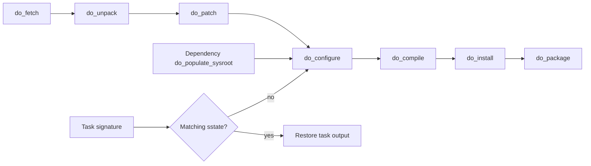
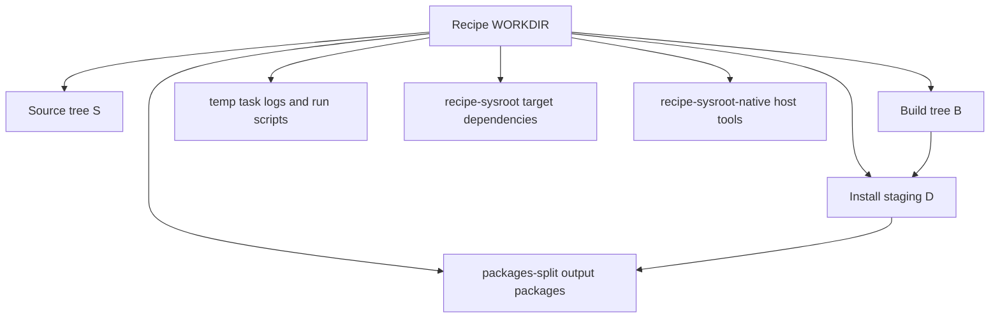

# Tasks and Workdirs

## What Problem Does This Solve?

BitBake executes recipes as task graphs. Task logs, generated run scripts, source trees, sysroots, installed files, and package splits all live in recipe work directories. Understanding these locations is the fastest path to diagnosing real build failures.

## Core Concepts

- task graph
- task dependency
- task signature
- `${WORKDIR}`
- `${S}`
- `${B}`
- `${D}`
- `temp/`
- recipe sysroot
- work-shared
- stamps
- task logs

## Mental Model

```text
recipe metadata
-> task graph
-> each task receives an environment and workdir
-> generated run script executes
-> log captures output
-> task output feeds later tasks or sstate
```



## Typical Task Lifecycle

```text
do_fetch
do_unpack
do_patch
do_prepare_recipe_sysroot
do_configure
do_compile
do_install
do_package
do_packagedata
do_package_write_<format>
```

Not every recipe uses every task, and classes can add or replace tasks.

## Listing Tasks

```sh
bitbake -c listtasks <recipe>
```

This shows available tasks and descriptions where provided.

## Running One Task

```sh
bitbake -c compile <recipe>
```

BitBake executes dependencies needed to make that task valid.

Force execution for investigation:

```sh
bitbake -f -c compile <recipe>
```

Forcing can taint dependent task state. Use it to investigate, not as a normal release workflow.

## Workdir Path

Find the exact workdir:

```sh
bitbake -e <recipe> | grep '^WORKDIR='
```

The path commonly includes:

- target architecture/tune or machine
- recipe name
- epoch/version/revision information

Do not memorize paths; query them.



## Important Workdir Areas

### `temp/`

Contains task logs and generated task scripts.

Common files:

```text
log.do_compile
run.do_compile
log.do_install
run.do_install
```

Read `log.do_<task>` first after a task failure. Read `run.do_<task>` to see the exact generated shell function and environment exports.

### `${S}`

Unpacked and patched source tree.

Changes here are temporary unless converted into metadata patches or source revisions.

### `${B}`

Build output directory. It can differ from `${S}`.

### `${D}`

Staged installation root created by `do_install`.

Inspect it when packaging reports missing or unshipped files.

### `packages-split/`

Shows files assigned to each output package after package splitting.

### `recipe-sysroot/`

Target headers, libraries, and files staged from build dependencies.

### `recipe-sysroot-native/`

Host-executed tools built or staged by Yocto.

## Work-Shared

Some components, especially kernels, use shared work areas so multiple recipes/tasks can access common source or output.

Inspect actual variables and recipe classes before modifying anything under `tmp/work-shared`.

## Task Logs

On failure, BitBake prints the log path. Preserve the first failing log.

Useful searches:

```sh
grep -n "error:" log.do_compile
grep -n "No such file" log.do_install
grep -n "QA Issue" log.do_package
```

Do not rely only on the final console summary; it often omits the real compiler or command context.

## Devshell

```sh
bitbake -c devshell <recipe>
```

A devshell provides a shell with much of the recipe build environment prepared.

Use it to:

- inspect environment variables
- run upstream configure/build commands
- test patches
- inspect sysroots

Changes remain temporary unless exported into metadata or source control.

## Task Dependencies

Generate graph data:

```sh
bitbake -g <target>
```

Task dependencies can be introduced by:

- `DEPENDS`
- task-level dependency flags
- class inheritance
- provider relationships
- image package dependencies

Avoid manually sequencing tasks when the real requirement is a missing dependency.

## Adding A Task

Conceptual example:

```bitbake
do_generate_product_data() {
    # Generate deterministic product data.
}

addtask generate_product_data after do_configure before do_compile
```

New tasks should have:

- clear inputs
- deterministic output
- correct ordering dependencies
- correct sstate behavior if reusable

Do not add a task solely to hide an upstream build-system problem.

## Task Functions And Appends

Extend an existing task:

```bitbake
do_install:append() {
    install -d ${D}${sysconfdir}/product
    install -m 0644 ${WORKDIR}/product.conf \
        ${D}${sysconfdir}/product/product.conf
}
```

Use `:prepend` or `:append` when additive behavior is appropriate. Replacing a task can discard important class-provided logic.

## Signatures

Task signatures capture relevant metadata and dependency inputs.

When a relevant input changes:

- task signature changes
- previous sstate output no longer matches
- task and affected downstream tasks execute again

When a seemingly relevant change does not trigger rebuilding, inspect whether the input is part of the task signature and whether metadata was changed in the correct scope.

## Cleaning

### `clean`

```sh
bitbake -c clean <recipe>
```

Removes recipe work output but can leave shared-state reuse available.

### `cleansstate`

```sh
bitbake -c cleansstate <recipe>
```

Removes work and relevant local shared-state output so tasks must be recreated or obtained from configured mirrors.

### `cleanall`

```sh
bitbake -c cleanall <recipe>
```

Also removes downloaded source. Rarely appropriate as a first debugging step.

## Re-running From A Specific Point

Typical investigation:

```sh
bitbake -f -c patch <recipe>
bitbake -f -c compile <recipe>
```

After metadata changes, normally let BitBake signatures determine what to rerun. Excessive forcing can obscure whether dependencies are modeled correctly.

## Failure Classification

### Fetch

Read `log.do_fetch`; check URL, branch, revision, credentials, mirrors, and checksums.

### Patch

Read `log.do_patch`; inspect `${S}` and patch context/order.

### Configure

Check cross-compilation detection, sysroot paths, feature options, and missing dependencies.

### Compile

Read the first compiler/linker error and generated command. Check host contamination and missing dependencies.

### Install

Inspect `${D}` and permissions. Check parallel install races and absolute paths.

### Package/QA

Inspect `${D}`, `packages-split`, `FILES`, dependencies, debug splitting, and QA messages.

## Kernel Workdir Investigation

```sh
bitbake -e virtual/kernel | grep -E '^(WORKDIR|S|B)='
bitbake virtual/kernel -c devshell
```

Then distinguish:

- Yocto recipe workdir
- kernel source tree
- kernel build output
- deploy directory
- rootfs module package output

## Worked Example: Diagnose A Missing Generated Header

Compile fails with:

```text
fatal error: product-version.h: No such file or directory
```

Trace:

1. Inspect `run.do_compile` for include paths.
2. Find which task should generate the header.
3. Confirm generation task runs before `do_compile`.
4. Confirm header is placed in `${B}` or expected include directory.
5. Add a real task dependency/order, not a sleep or repeated compile.

Example:

```bitbake
addtask generate_version after do_configure before do_compile
```

## Worked Example: Compare Install And Package Output

```sh
bitbake example -c install -f
bitbake -e example | grep -E '^(D|WORKDIR)='
```

Compare `${D}` with `${WORKDIR}/packages-split/`. A file in `${D}` but absent from all split packages is a packaging ownership problem, not a compile problem.

## Common Mistakes

- Editing `${S}` and losing the change after clean/unpack.
- Reading only console output instead of task logs.
- Replacing tasks and discarding inherited behavior.
- Using `cleanall` reflexively.
- Adding task-order hacks instead of dependencies.
- Confusing `${D}` with final image rootfs.
- Assuming a successful `do_compile` implies packaging or image inclusion.

## Debugging Checklist

- Which exact task failed?
- What is `${WORKDIR}`?
- What does `log.do_<task>` show at the first error?
- What command is in `run.do_<task>`?
- What are `${S}`, `${B}`, and `${D}`?
- Are dependencies present in recipe sysroots?
- Was output restored from sstate?
- Did task signatures change after metadata edits?
- Are files installed and assigned to packages?

## Related Topics

- [Mental Model](mental-model.md)
- [Recipes](recipes.md)
- [Debugging BitBake Builds](debugging-bitbake-builds.md)
- [Reproducibility, Caches, and Mirrors](reproducibility-caches-and-mirrors.md)

## References

- BitBake User Manual
- Yocto Project Reference Manual
- Yocto Project Development Tasks Manual
