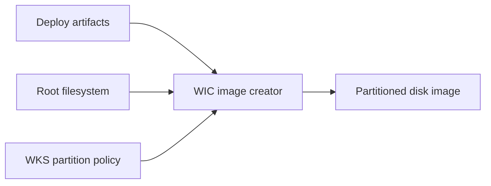
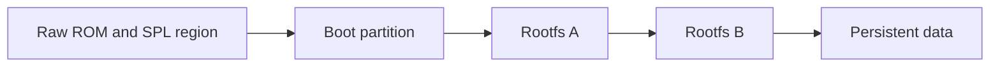

# WIC and Partition Layouts

## What Problem Does This Solve?

WIC creates complete disk images from root filesystems, boot artifacts, partition policy, and raw bootloader regions. It turns separate kernel, DTB, U-Boot, rootfs, and data artifacts into media suitable for SD or eMMC deployment.

## Core Concepts

- `.wks`
- kickstart syntax
- `part`
- `bootloader`
- source plugin
- raw copy
- partition alignment
- fixed/growable size
- boot partition
- rootfs partition
- UUID/label

## Mental Model

```text
deploy artifacts + rootfs + .wks layout
-> WIC source plugins
-> partition table and filesystems
-> raw disk image
-> flash to SD/eMMC
```





## Minimal Layout Example

```text
part /boot --source bootimg-partition --ondisk mmcblk \
    --fstype=vfat --label boot --active --align 4 --size 128

part / --source rootfs --ondisk mmcblk \
    --fstype=ext4 --label rootfs --align 4 --size 1024

bootloader --ptable gpt
```

Exact source plugin options and variable expansion depend on the active Yocto release and BSP classes.

## Selecting A WKS File

Machine or image metadata can identify the WKS source.

Conceptually:

```bitbake
WKS_FILE = "product.wks.in"
IMAGE_FSTYPES += "wic"
```

Store product layout in product/BSP metadata, not a developer build directory.

## Worked Example: Boot, Rootfs, And Data

```text
part /boot --source bootimg-partition --fstype=vfat \
    --label boot --active --align 4 --size 128

part / --source rootfs --fstype=ext4 \
    --label rootfs --align 4 --size 1536

part /data --fstype=ext4 --label data \
    --align 4 --size 512 --fsoptions="defaults"

bootloader --ptable gpt
```

Questions to resolve:

- should `/data` ship empty or prepopulated?
- should it grow to fill media?
- how will updates preserve it?
- how are labels/UUIDs referenced in bootargs/fstab?

## Boot Image Source

Boot source plugins may collect files from deploy output according to variables/classes.

Potential contents:

- kernel image
- DTBs/overlays
- initramfs
- boot scripts
- extlinux configuration
- U-Boot artifacts for filesystem-based stages

Inspect final partition instead of assuming all deploy files are included.

## Raw Bootloader Regions

Some SoCs boot from fixed raw offsets before partitions.

WIC layouts can use raw-copy-style sources or BSP-specific plugins to place artifacts.

For each raw region document:

- artifact
- byte/sector offset
- maximum size
- alignment
- security variant
- ROM consumer
- overlap constraints

A partition table can overwrite raw boot regions if offsets are not designed together.

## TI-Style Artifact Example

A TI platform can require multiple boot artifacts such as first stage, SPL-like stage, and U-Boot proper. Depending on SoC/SDK, these may live in a FAT boot partition or raw regions.

Do not copy an EVM WKS layout blindly to custom hardware. Check:

- ROM boot mode
- SD vs eMMC behavior
- secure device artifacts
- boot partition filenames
- raw offsets
- rootfs device naming

## Alignment And Size

Alignment affects:

- ROM requirements
- flash erase geometry
- performance
- partition tool compatibility

Size policy includes:

- minimum filesystem size
- overhead factor
- fixed partition size
- grow-to-fill behavior
- update slot sizing

Leave explicit margin for filesystem growth and package updates.

## A/B Layout Example

Conceptual layout:

```text
boot
rootfs-a
rootfs-b
data
```

Additional policy is required:

- active slot state
- boot count and rollback
- immutable slot identifiers
- update atomicity
- data compatibility across versions

WIC creates layout; it does not implement the complete update state machine.

## Inspecting A WIC Image

Useful host tools can include:

```sh
fdisk -l product.wic
parted product.wic unit s print
wic ls product.wic
```

Tool availability and `wic` subcommands vary by environment/release.

For deeper inspection, map partitions read-only using appropriate host tooling and privileges. Avoid modifying release images during verification.

## Worked Verification Checklist

1. Print partition table and sector offsets.
2. Confirm no overlap with raw bootloader regions.
3. List boot partition files.
4. Compare kernel/DTB/U-Boot checksums with deploy output.
5. Inspect rootfs release and package manifest.
6. Verify labels/UUIDs match bootargs and `/etc/fstab`.
7. Flash known media.
8. capture serial log and runtime partition identities.

## Custom Source Plugins

Create a custom plugin only when standard plugins cannot model required artifact placement.

A plugin should:

- declare input artifacts
- fail clearly when inputs are missing
- place data deterministically
- avoid hidden host dependencies
- be covered by image-layout tests

Prefer upstream/vendor-provided plugins for standard SoC boot layouts.

## Common Mistakes

- Assuming deploy output automatically enters WIC.
- Using wrong filename/symlink for kernel or DTB.
- Overlapping raw bootloader data and partition table.
- Hardcoding EVM offsets for a different boot flow.
- Forgetting secure/non-secure artifact variants.
- Creating partitions too small for updates.
- Treating A/B partitions as a complete update solution.
- Validating `.wks` text but not final image bytes.

## Debugging Checklist

- Which WKS file is selected?
- Which source plugins run?
- What artifacts do they consume?
- What are partition offsets/sizes/labels?
- Are raw regions documented and non-overlapping?
- Do boot partition checksums match deploy output?
- Do bootargs/fstab use correct identities?
- Is the flashed image the validated WIC artifact?

## Related Topics

- [Images and Package Groups](images-and-packagegroups.md)
- [Kernel and Bootloader Integration](kernel-and-bootloader-integration.md)
- [BSP Image Layout and Deployment](../bsp-integration/image-layout-and-deployment.md)
- [U-Boot Cross-Building and Flashing](../u-boot/cross-building-and-flashing.md)

## References

- Yocto Project WIC documentation
- Yocto Project BSP Developer's Guide
- SoC vendor boot media documentation
