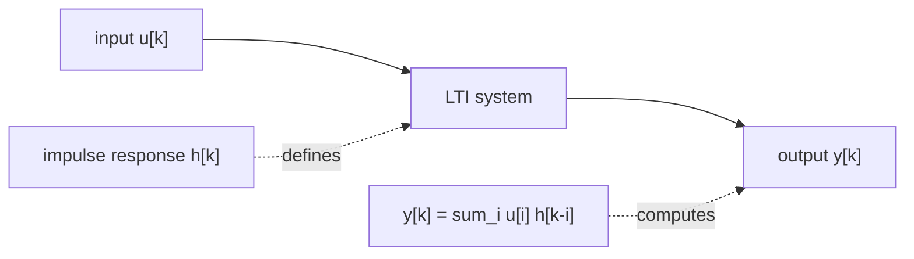
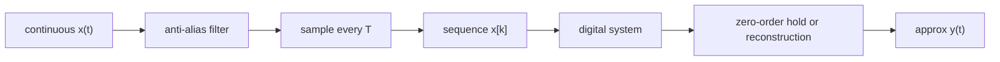
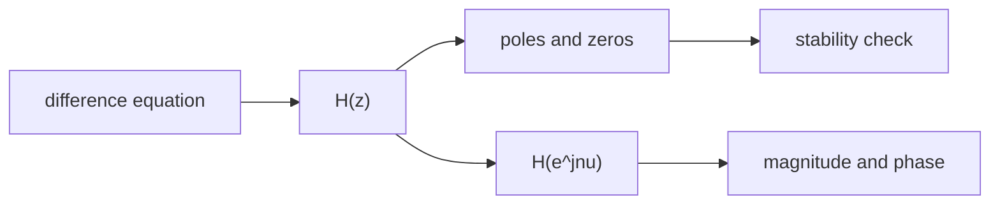

# Signal Processing Diagram Instructions

## Taxonomy

- Parent: [Signal Processing](index.md)
- Page type: authoring/reference support
- Applies to: Signals And Systems, Digital Signal Processing, Measurement And Instrumentation, and Infocommunication
- Purpose: keep figures version-controlled and renderable from Markdown whenever practical

## Diagram Policy

Signal processing pages should use text-versioned diagrams by default. Prefer diagrams that render from Markdown instead of binary images.

Use this priority order:

1. Mermaid fenced blocks for block diagrams, pipelines, state updates, transform relationships, and learning-path maps.
2. Markdown tables for short sequences, coefficient lists, and state updates.
3. ASCII `text` fences for qualitative axis sketches when Mermaid cannot express the plot clearly.
4. Generated PNG/SVG only when the figure is a real numeric plot. Store the code that generates it under `examples/`, and do not paste base64 images into Markdown.

## Mermaid Rules

- Use `flowchart LR` for signal-processing pipelines.
- Keep diagrams below about 12 nodes.
- Use short ASCII node ids.
- Put equations in node labels only when they are short.
- Avoid visual decoration that does not add technical information.
- Use one diagram per concept.
- Prefer labels like `u[k]`, `h[k]`, `y[k]`, `H(z)`, `H(e^jnu)`, `sample T`, and `delay z^-1`.
- For feedback filters, show the delay and feedback path explicitly.
- Do not use Mermaid for quantitative signal plots; use generated plots or an ASCII sketch.

## Examples

LTI convolution model:



Sampling and reconstruction pipeline:



z-domain filter descriptions:



Qualitative pole-zero sketch:

```text
z-plane

          Im
          ^
    x     |      o
          |
----------+----------> Re
          |
    x     |      o

x = pole, o = zero, unit circle implied
```
