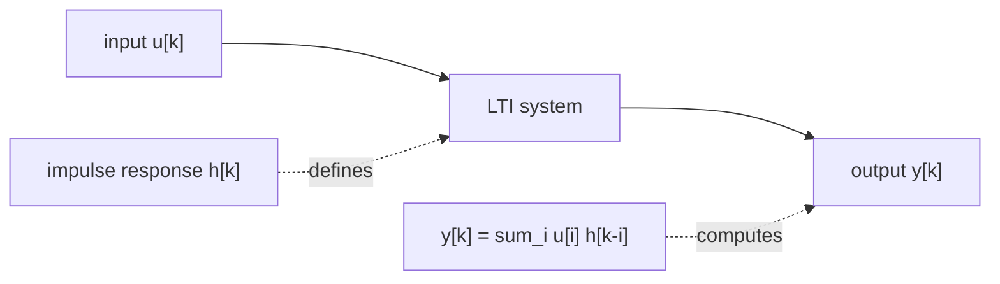
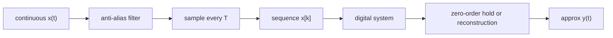
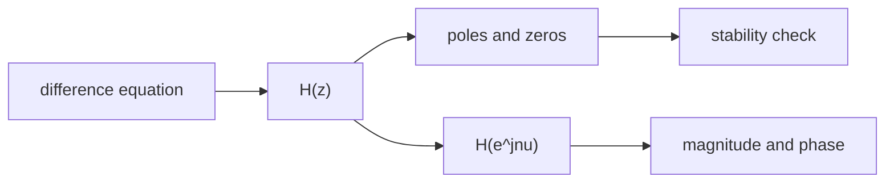

# Signal Processing Diagram Instructions

## Taxonomy

- Parent: [Signal Processing](index.md)
- Page type: authoring/reference support
- Applies to: Signals And Systems, Digital Signal Processing, Measurement And Instrumentation, and Infocommunication
- Purpose: keep figures version-controlled and renderable from Markdown whenever practical
- Companion instruction page: [Authoring Instructions](authoring-instructions.md)

## Diagram Policy

Signal processing pages should use text-versioned diagrams by default. Prefer diagrams that render from Markdown instead of binary images.

Use this priority order:

1. Mermaid fenced blocks for block diagrams, pipelines, state updates, transform relationships, and learning-path maps.
2. Markdown tables for short sequences, coefficient lists, and state updates.
3. ASCII `text` fences for qualitative axis sketches when Mermaid cannot express the plot clearly.
4. Generated SVG [SVG-ábra] for real numeric plots. Store the code that generates it under `examples/signal-processing/`, place generated assets under `docs/assets/signal-processing/`, and do not paste base64 images into Markdown.
5. Generated PNG [PNG-ábra] only for dense raster plots such as spectrograms or heat maps where SVG becomes too large.

## Mermaid Rules

- Use `flowchart LR` for signal-processing pipelines.
- Render Mermaid fences through `pymdownx.superfences.fence_div_format`; if they appear as code blocks, the MkDocs fence formatter is wrong.
- Keep diagrams below about 12 nodes.
- Use short ASCII node ids.
- Put equations in node labels only when they are short.
- Avoid visual decoration that does not add technical information.
- Use one diagram per concept.
- Prefer labels like `u[k]`, `h[k]`, `y[k]`, `H(z)`, `H(e^jnu)`, `sample T`, and `delay z^-1`.
- For feedback filters, show the delay and feedback path explicitly.
- Do not use Mermaid for quantitative signal plots; use generated plots or an ASCII sketch.

## Numeric Plot Rules

Use a numeric plot [numerikus ábra] when the visual meaning depends on actual values, scales, or frequency locations. This is especially important for time-domain plots [időtartománybeli ábrák], frequency-domain plots [frekvenciatartománybeli ábrák], spectra [spektrumok], pole-zero maps [pólus-zérus térképek], Bode diagrams [Bode-diagramok], and spectrograms [spektrogramok].

For every generated figure:

- keep the source script [forrásszkript] in `examples/signal-processing/<subtopic>/`
- write output files to `docs/assets/signal-processing/<subtopic>/`
- prefer deterministic SVG output for line plots
- include axis labels, units, and important parameters such as `fs`, `T`, `N`, window type, or transform convention
- mention the generating script below the image when the plot is nontrivial
- do not hand-edit generated figure files

Recommended Markdown pattern:

```text


Source: `examples/signal-processing/signals-and-systems/sampled-sinusoid.py`
```

For paired time and frequency views, use the same signal definition and state the shared parameters once before the figures. This prevents misleading comparisons caused by inconsistent sample rates, amplitudes, or normalization.

## Examples

LTI convolution model:



Sampling and reconstruction pipeline:



z-domain filter descriptions:



Qualitative pole-zero sketch:

```text
z-plane

          Im
          ^
    x     |      o
          |
----------+----------> Re
          |
    x     |      o

x = pole, o = zero, unit circle implied
```
