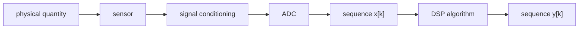
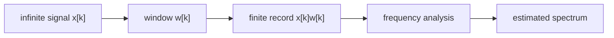
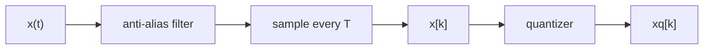
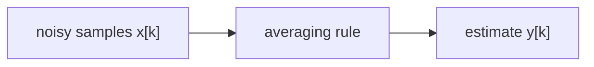
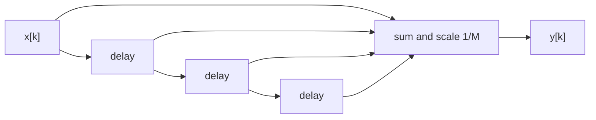
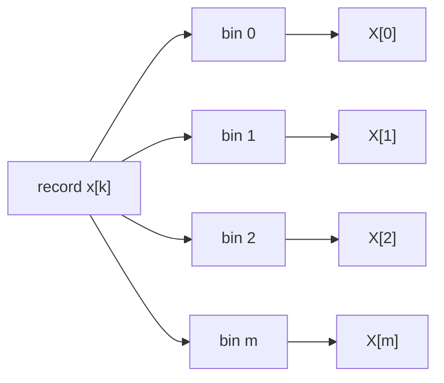

# Digital Signal Processing [digitális jelfeldolgozás] Theory

## Taxonomy

- Parent: [Digital Signal Processing](index.md)
- Grandparent: [Signal Processing](../index.md)
- Page type: theory
- Companion pages: [Programming](programming.md), [References](references.md)
- Foundation dependency: [Signals And Systems Theory](../signals-and-systems/theory.md)

This first theory batch works out the core ideas needed before the practical programming material. The sections are ordered so each one depends only on concepts introduced earlier.

## 1. DSP Signal Model

Digital signal processing starts when a signal [jel] is represented as a sequence [sorozat] of numbers. The original phenomenon may be continuous-time [folytonos idejű], but DSP algorithms operate on indexed samples [minták].

The usual acquisition path starts with a physical quantity [fizikai mennyiség], a sensor [érzékelő], signal conditioning [jelkondicionálás], and an analog-to-digital converter [analóg-digitális átalakító, ADC]. After that point the program sees numbers.



The central representation is:

```text
x[k] = x(kT)
```

where `k` is the sample index [mintaindex] and `T` is the sampling period [mintavételi idő]. The sampling frequency [mintavételi frekvencia] is:

```text
fs = 1 / T
```

Use `k` or `n` consistently in a page or program. Both are common, but mixing them without reason makes algorithms harder to inspect.

### Records And Observation Windows

A real program never sees an infinite sequence. It sees a finite record [véges mintaregisztrátum]:

```text
x[0], x[1], ..., x[N-1]
```

This finite record is equivalent to multiplying the infinite sequence by an observation window [megfigyelési ablak]. That fact is the source of many later spectrum-analysis [spektrumanalízis] effects explained in Section 4.



### Deterministic And Stochastic Signals

A deterministic signal [determinisztikus jel] is modeled as a known function or sequence. Typical examples are impulses, steps, sinusoids, exponentials, and chirps.

A stochastic signal [sztochasztikus jel] is modeled as a random process [sztochasztikus folyamat]. In DSP, stochastic signals appear naturally as measurement noise [mérési zaj], quantization noise [kvantálási zaj], random input signals for identification, and communication-channel noise [hírközlési csatornazaj].

Important stochastic descriptors:

- expected value [várható érték]: typical average level
- variance [variancia, szórásnégyzet]: average squared deviation from the mean
- autocorrelation [autokorreláció]: similarity of a signal with a delayed version of itself
- power spectral density [teljesítménysűrűség-spektrum]: distribution of average power over frequency
- stationarity [stacionaritás]: statistical properties do not change with absolute time
- ergodicity [ergodicitás]: time averages can represent ensemble averages under suitable assumptions

For programming, this distinction matters because deterministic examples are good for exact regression tests, while stochastic examples require statistical checks and tolerances.

## 2. Sampling And Quantization

Sampling [mintavételezés] converts a continuous-time signal into a sequence. Quantization [kvantálás] converts each sample value into one of finitely many representable levels. A typical sampling path includes an anti-alias filter [átlapolódásgátló szűrő] before the sampler and a quantizer [kvantáló] after the sampler.



### Sampling And Aliasing

The sampling theorem [mintavételi tétel] says that a band-limited signal [sávkorlátozott jel] can be reconstructed from uniform samples if the sample rate is high enough. In the common engineering form:

```text
fs > 2B
```

where `B` is the highest frequency present in the signal.

Aliasing [átlapolódás] happens when spectral copies created by sampling overlap. Once aliasing occurs, the lost distinction cannot be recovered by digital processing after the ADC.

```text
frequency axis

before sampling:
        |--- signal band ---|
-------0--------------------B------------------------>

after safe sampling:
        |--- band ---|       |--- image ---|
-------0-------------B------fs-B-----------fs-------->

after undersampling:
        |--- band overlaps image ---|
-------0-------------B------fs-B--------------------->
```

The anti-alias filter is placed before sampling because it must remove dangerous high-frequency content before it folds into the useful band.

### Under- And Oversampling

Undersampling [alulmintavételezés] means the sample rate is too low for the signal bandwidth, or intentionally low in a bandpass sampling setup. It is dangerous unless the spectral placement is designed explicitly.

Oversampling [túlmintavételezés] means sampling faster than the minimum requirement. It gives transition bands [átmeneti sávok] more room, can reduce in-band quantization-noise density after filtering, and often simplifies analog anti-alias filter requirements.

### Quantizer Model

A uniform quantizer [egyenletes kvantáló] maps a real-valued sample to the nearest quantization level [kvantálási szint]. If the quantizer step size [kvantálási lépésköz] is `Delta`, a simple model is:

```text
xq[k] = Q(x[k])
e[k]  = xq[k] - x[k]
```

where `e[k]` is the quantization error [kvantálási hiba].

```text
quantizer characteristic

xq
^
|        ______
|       |
|   ____|
|  |
|__|
+-----------------> x
```

For many practical analyses, quantization error is approximated as additive white noise [additív fehér zaj]:

```text
xq[k] = x[k] + e[k]
```

This model is useful, but it is not automatically true. It works best when the signal is sufficiently busy relative to the quantizer step, and when the quantization error is not strongly correlated with the input.

For a high-resolution uniform quantizer, the common noise-variance approximation is:

```text
var(e) = Delta^2 / 12
```

Dither [dither] is intentionally added noise before quantization. Its purpose is not to improve each sample, but to make the quantization error less signal-dependent and more noise-like.

## 3. Averaging And Elementary Filters

Averaging [átlagolás] is the first DSP tool that behaves both like estimation [becslés] and filtering [szűrés]. It reduces random fluctuations when the wanted quantity is constant or changes slowly.



### Ideal Average

For a finite record of `N` samples, the ideal average [ideális átlag] is:

```text
mean(x) = (1/N) sum_{k=0}^{N-1} x[k]
```

This is a good estimator for a constant value in independent zero-mean noise. Its variance decreases as the number of independent samples increases.

### Recursive Average

The same average can be updated recursively [rekurzívan] without recomputing the full sum:

```text
m[k] = m[k-1] + (x[k] - m[k-1]) / k
```

This form is important in streaming DSP [adatfolyam-alapú digitális jelfeldolgozás], because samples arrive one at a time.

### Moving Average

A moving average [mozgó átlag] uses only the most recent `M` samples:

```text
y[k] = (1/M) sum_{i=0}^{M-1} x[k-i]
```

It is a finite impulse response filter [véges impulzusválaszú szűrő, FIR]. Its impulse response [impulzusválasz] is a rectangle:

```text
h[k] = 1/M for k = 0, 1, ..., M-1
h[k] = 0 otherwise
```



The moving average is a low-pass filter [aluláteresztő szűrő]. It suppresses fast fluctuations, but it also smears abrupt changes and introduces delay.

### Exponential Average

An exponential average [exponenciális átlag] gives the newest sample a fixed weight:

```text
y[k] = alpha x[k] + (1 - alpha) y[k-1]
```

where `0 < alpha <= 1`.

This is an infinite impulse response filter [végtelen impulzusválaszú szűrő, IIR]. Small `alpha` gives stronger smoothing but slower reaction. Large `alpha` reacts faster but suppresses noise less.

### Frequency-Domain View

Averaging is easier to tune when viewed as a frequency response [frekvenciaátvitel]. The moving average has zeros [zérusok] at frequencies where the delayed samples cancel each other. The exponential average has a pole [pólus], so its stability and response depend on the feedback factor `1 - alpha`.

The practical rule:

- use a finite average when the relevant record length is known
- use a moving average when you need finite memory
- use an exponential average when you need a cheap streaming smoother

## 4. DFT And Spectral Estimation

The discrete Fourier transform [diszkrét Fourier-transzformáció, DFT] maps `N` time samples to `N` frequency bins [frekvenciavonalak]:

```text
X[m] = sum_{k=0}^{N-1} x[k] exp(-j 2 pi m k / N)
```

The inverse DFT reconstructs the `N` samples from those coefficients:

```text
x[k] = (1/N) sum_{m=0}^{N-1} X[m] exp(j 2 pi m k / N)
```

The fast Fourier transform [gyors Fourier-transzformáció, FFT] is an efficient algorithm for computing the DFT. It changes the computational cost, not the mathematical result.

### Frequency Bins

If the sample rate is `fs` and the record length is `N`, DFT bin `m` corresponds to:

```text
f_m = m fs / N
```

The frequency spacing [frekvenciafelbontás] is:

```text
Delta f = fs / N
```

This does not mean the DFT can perfectly resolve any two tones separated by `Delta f`. Resolution also depends on the observation window, signal duration, signal-to-noise ratio [jel-zaj viszony], and window shape.

### DFT As A Filter Bank

The DFT can be interpreted as a bank of filters [szűrőbank]. Each bin measures how much the record resembles a complex sinusoid [komplex szinuszos jel] at that bin frequency.



This view explains why the DFT is useful for measurement: each bin is a narrow frequency-selective observer of the input record.

### Coherent Sampling

Coherent sampling [koherens mintavételezés] means the finite record contains an integer number of periods of a periodic component [periodikus komponens]. In that case, a sinusoid lands exactly on DFT bins and the spectrum is clean.

Noncoherent sampling [nem koherens mintavételezés] means the record cuts the periodic waveform at a non-period boundary. Then the DFT sees a discontinuity at the record boundary, and the energy spreads across bins.

### Spectral Leakage And Picket-Fence Effect

Spectral leakage [spektrális szivárgás] is energy spreading from one frequency into many DFT bins because of finite observation and windowing.

The picket-fence effect [léckerítés-hatás] is the amplitude error caused by the true frequency falling between DFT bin centers.

```text
ideal tone:

amplitude
^
|          |
|          |
+----------+----------------> frequency
          f0

off-bin finite-record DFT:

amplitude
^
|        /\ 
|      _/  \_
|  ___/      \___
+---------------------------> frequency
       bin bin bin
```

### Window Functions

A window function [ablakfüggvény] changes how strongly samples near the record edges contribute to the DFT. A rectangular window [négyszögablak] keeps all samples equally. A Hann window [Hann-ablak] tapers the edges. A flat-top window [flat-top ablak] improves amplitude accuracy at the cost of wider main lobes.

Tradeoff:

- narrow main lobe [főhullám]: better frequency separation
- low side lobes [oldalhullámok]: less leakage from strong nearby tones
- flat main lobe: better amplitude estimate when the tone is between bins

Equivalent noise bandwidth [ekvivalens zajsávszélesség] describes how much white-noise power passes through a windowed spectral bin. It matters when estimating noise floors and power spectral density.

### Periodogram And Averaging

A periodogram [periodogram] estimates power spectrum from a finite record:

```text
P[m] proportional to |X[m]|^2
```

For stochastic signals, a single periodogram has high variance. Averaging is therefore essential.

Common approaches:

- Bartlett averaging [Bartlett-átlagolás]: split the record into non-overlapping segments and average their periodograms
- Welch averaging [Welch-átlagolás]: use overlapping, windowed segments and average their periodograms


The cost of averaging is reduced frequency resolution. The benefit is a more stable estimate.

Later spectral-analysis additions should work out:

- DFT filters [DFT-szűrők] and comb filters [fésűszűrők]
- recursive DFT [rekurzív DFT]
- DFT as an observer [megfigyelő]
- FFT analyzer [FFT-analizátor]
- band-selective FFT [sávkiválasztó FFT] and zoom FFT [zoom FFT]
- spectrum shifting [spektrumeltolás]
- DFT interpolation [DFT-interpoláció] and zero padding [nullákkal való kiegészítés]
- scalloping loss [amplitúdóveszteség bin-középen kívüli frekvencián]
- autocorrelation and cross-correlation estimation [keresztkorreláció-becslés]

## 5. Next Theory Batch: Time-Frequency Analysis

The next batch should work out:

- short-time Fourier transform [rövid idejű Fourier-transzformáció, STFT]
- spectrogram [spektrogram]
- analysis window [analízisablak] length
- time resolution [időfelbontás] vs frequency resolution [frekvenciafelbontás]
- hop size [lépésköz] and overlap [átlapolás]
- wavelets [waveletek] as an optional advanced extension

## 6. Next Theory Batch: Digital Filters

The next filter batch should work out:

- FIR and IIR systems
- direct forms [direkt alakok] and second-order sections [másodfokú szakaszok]
- pole-zero design interpretation
- numerical robustness [numerikus robusztusság] in recursive filters [rekurzív szűrők]
- IIR design from analog prototypes [analóg prototípusok]
- Butterworth filters [Butterworth-szűrők], Chebyshev filters [Csebisev-szűrők], and elliptic filters [elliptikus szűrők]
- bilinear transform [bilineáris transzformáció] and frequency prewarping [frekvencia-előtorzítás]
- FIR design by windowing [ablakozás]
- equiripple/Remez FIR design [egyenhullámosságú/Remez-tervezés]
- FIR vs IIR tradeoffs

## 7. Later Theory Batch: Multirate DSP And Fast Convolution

This batch should work out:

- multirate DSP [többsebességű digitális jelfeldolgozás]
- fast convolution [gyors konvolúció]
- decimation [ritkítás, decimálás]
- interpolation [interpoláció]
- rational resampling [racionális újramintavételezés]
- sample-rate conversion [mintavételi frekvencia átalakítás]
- anti-imaging filters [képmásgátló szűrők]
- anti-alias filters in decimators [decimátorok átlapolódásgátló szűrői]
- polyphase filters [polifázisú szűrők]
- CIC filters [CIC-szűrők, kaszkádolt integráló-fésűs szűrők]
- multirate filter banks [többsebességű szűrőbankok]
- circular vs linear convolution [ciklikus és lineáris konvolúció]
- overlap-add convolution [átfedéses összeadásos konvolúció]
- overlap-save convolution [átfedéses mentéses konvolúció]
- block convolution [blokk-konvolúció]
- partitioned convolution [particionált konvolúció]
- streaming buffers [adatfolyam-pufferek]
- latency and block-size tradeoffs [késleltetés és blokkméret kompromisszumok]

## 8. Later Theory Batch: Model Fitting, Identification, And Adaptive Filtering

This batch should work out:

- model fitting [modellillesztés]
- regression [regresszió]
- parameter estimation [paraméterbecslés] vs adaptation [adaptáció]
- system identification [rendszeridentifikáció]
- impulse-response estimation [impulzusválasz-becslés]
- transfer-function fitting [átviteli függvény illesztés]
- chirp [csirp], MLS [maximális hosszúságú sorozat], and PRBS excitation [pszeudovéletlen bináris gerjesztés]
- coherence [koherencia]
- frequency-response-function estimation [frekvenciaátviteli függvény becslés]
- validation residuals [validációs maradékok]
- adaptive linear combiner [adaptív lineáris kombinátor]
- mean-square error cost [négyzetes középhiba célfüggvény]
- Wiener-Hopf equation [Wiener-Hopf-egyenlet]
- steepest descent [legmeredekebb ereszkedés]
- LMS [legkisebb négyzetes középértékű algoritmus]
- NLMS [normalizált LMS]
- LMS-Newton [LMS-Newton-algoritmus]
- adaptive IIR filters [adaptív IIR-szűrők]
- equation-error adaptation [egyenlethiba-alapú adaptáció]
- output-error adaptation [kimeneti hiba alapú adaptáció]
- filtered-x LMS [szűrt-x LMS]
- adaptive line enhancement [adaptív vonalkiemelés]
- echo cancellation [visszhangkioltás]
- active noise control [aktív zajszabályozás]

## 9. Later Theory Batch: Compensation And Sensor Fusion Algorithms

This batch should work out:

- compensation [kompenzálás]
- sensor fusion [szenzorfúzió]
- measurement-chain transfer model [mérőlánc átviteli modell]
- inverse filtering [inverz szűrés] as deconvolution [dekonvolúció]
- ill-conditioned inverse problems [rosszul kondicionált inverz feladatok]
- Tikhonov regularization [Tyihonov-regularizáció]
- Wiener filtering [Wiener-szűrés]
- Kalman filtering [Kalman-szűrés]
- Bayesian sensor fusion [Bayes-i szenzorfúzió]
- Dempster-Shafer fusion [Dempster-Shafer-fúzió]
- reliability weighting [megbízhatósági súlyozás] and conflict handling [konfliktuskezelés]

## 10. Later Theory Batch: Fixed-Point, Real-Time, And Validation Concepts

This batch should work out:

- sample-by-sample processing [mintánkénti feldolgozás]
- block processing [blokkos feldolgozás]
- latency [késleltetés] and state [állapot]
- fixed-point arithmetic [fixpontos aritmetika]
- Q formats [Q-formátumok]
- scaling [skálázás] and headroom [tartalék]
- saturation [szaturáció] vs wraparound [túlcsordulásos körbefordulás]
- coefficient quantization [együttható-kvantálás]
- IIR limit cycles [IIR-határciklusok]
- overflow analysis [túlcsordulás-elemzés]
- block floating point [blokkos lebegőpontos ábrázolás]
- processor workflow [processzor munkafolyamat]
- reproducible plotted artifacts [reprodukálható ábrák]
- golden-signal tests [referenciajel-tesztek]
- comparison against reference implementations [referencia-implementációkkal való összehasonlítás]
