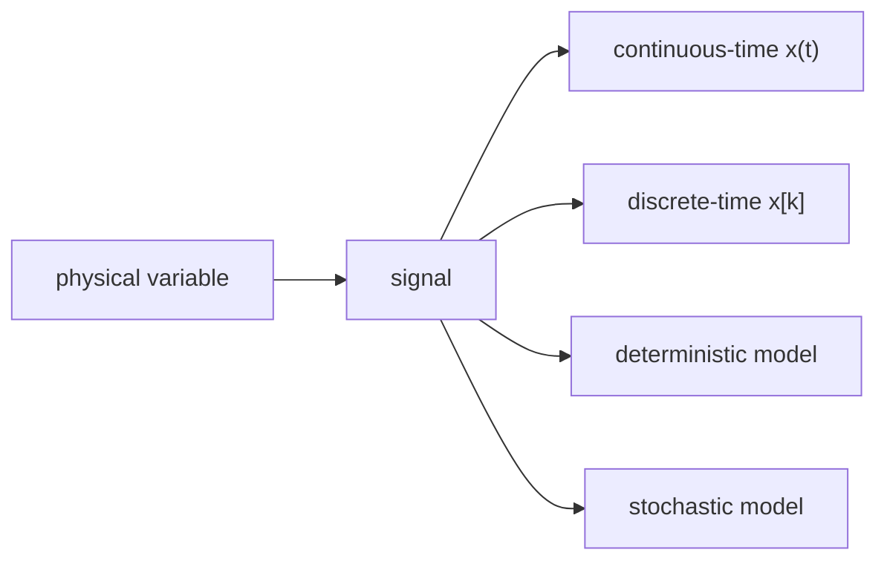
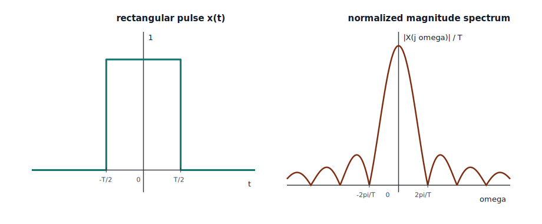
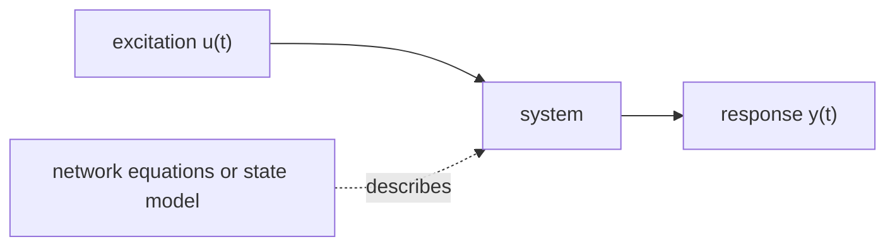
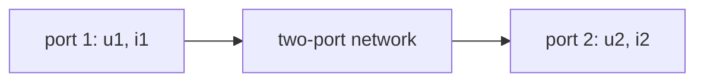
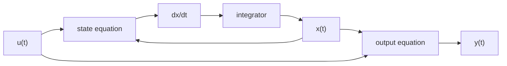
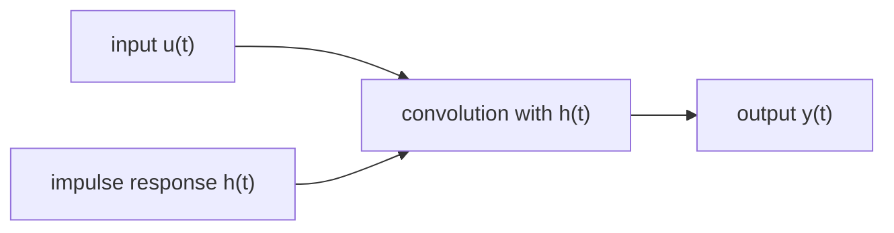
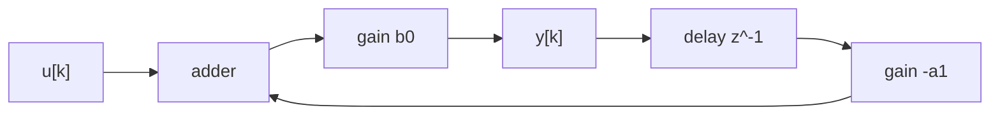

# Signals And Systems [jelek és rendszerek] Theory

## Taxonomy

- Parent: [Signals And Systems](index.md)
- Grandparent: [Signal Processing](../index.md)
- Page type: theory
- Companion pages: [Programming](programming.md), [References](references.md)
- Downstream users: DSP filters and transforms, measurement-chain modeling, communication channels and modulation
- Primary source batches: `Jelek1_Előadásjegyzet_DM.pdf` and `Régi, de jó jegyzet.pdf`

This page is a worked theory draft for the two-course Signals And Systems curriculum. It keeps the course order: first the continuous-time signal, network, state-space, nonlinear, and sinusoidal steady-state material; then the transform, discrete-time, sampling, and simulation material.

## 1. Signal Vocabulary

A physical variable [fizikai változó] is a mathematical description of a physical phenomenon. A signal [jel] is the part of that description that carries information relevant to the analysis. In the course notes the most common physical variables are voltage [feszültség] and current [áram], but the same theory applies to pressure, position, temperature, sampled data, and communication waveforms.

Signals are classified along three independent axes:

| Axis | Types | Meaning |
| --- | --- | --- |
| Time | continuous-time [folytonos idejű] or discrete-time [diszkrét idejű] | whether the independent variable is continuous `t` or an index `k` |
| Value | continuous-valued [folytonos értékű] or discrete-valued [diszkrét értékű] | whether the amplitude can take arbitrary values or only selected levels |
| Determinacy | deterministic [determinisztikus] or stochastic [sztochasztikus] | whether the value is fully specified or described statistically |



The notation convention is:

- `x(t)` for a continuous-time signal
- `x[k]` for a discrete-time signal
- `u` for excitation/input [gerjesztés]
- `y` for response/output [válasz]

### Elementary Signal Operations

Time shift [időeltolás], time scaling [időskálázás], and amplitude scaling [amplitúdóskálázás] are the basic operations used throughout the course:

\[
\begin{aligned}
\text{delay by } t_0 &: x(t-t_0) \\
\text{advance by } t_0 &: x(t+t_0) \\
\text{time scaling} &: x(at) \\
\text{amplitude scaling} &: A x(t)
\end{aligned}
\]

Even and odd decomposition [páros és páratlan felbontás] is often useful before Fourier analysis:

\[
\begin{aligned}
x_\mathrm{e}(t) &= \frac{x(t)+x(-t)}{2} \\
x_\mathrm{o}(t) &= \frac{x(t)-x(-t)}{2} \\
x(t) &= x_\mathrm{e}(t)+x_\mathrm{o}(t)
\end{aligned}
\]

The same idea works in discrete time by replacing `t` with `k`.

### Special Signals

The unit step [egységugrás] is the signal that turns on at zero:

\[
\varepsilon(t)=
\begin{cases}
0, & t<0 \\
1, & t>0
\end{cases}
\]

The Dirac delta [Dirac-delta] is not an ordinary function but a distribution [disztribúció]. It is defined by its sampling property:

\[
\int_{-\infty}^{\infty} x(t)\delta(t-t_0)\,dt = x(t_0)
\]

The Kronecker impulse [Kronecker-impulzus] is the discrete-time counterpart:

\[
\delta[k]=
\begin{cases}
1, & k=0 \\
0, & k\neq 0
\end{cases}
\]

A rectangular window [négyszögablak] is a finite-duration pulse. It is useful both as a test signal and as a bridge to Fourier analysis: narrow time-domain features imply broad frequency-domain content.



Source: `examples/signal-processing/signals-and-systems/rect-pulse-transform.py`

### Periodic Signal Descriptors

A periodic signal [periodikus jel] satisfies:

\[
x(t+T)=x(t)
\]

where the smallest positive `T` is the period [periódusidő]. The fundamental angular frequency [alapkörfrekvencia] and fundamental frequency [alapfrekvencia] are:

\[
\omega_0=\frac{2\pi}{T},
\qquad
f_0=\frac{1}{T}
\]

Common descriptors:

\[
\begin{aligned}
X_0 &= \frac{1}{T}\int_0^T x(t)\,dt && \text{mean value} \\
X_\mathrm{a} &= \frac{1}{T}\int_0^T |x(t)|\,dt && \text{absolute mean} \\
X_\mathrm{RMS} &= \sqrt{\frac{1}{T}\int_0^T x^2(t)\,dt} && \text{RMS value}
\end{aligned}
\]

For electrical signals, RMS value [effektív érték] is physically important because a constant current with the same RMS value dissipates the same average power in a resistor.

Signal energy [jelenergia] and average power [átlagteljesítmény] separate finite-duration transients from persistent periodic signals:

\[
E_x = \int_{-\infty}^{\infty}|x(t)|^2\,dt,
\qquad
P_x = \lim_{T\to\infty}\frac{1}{2T}\int_{-T}^{T}|x(t)|^2\,dt
\]

## 2. Network And System Models

A network [hálózat] is an interconnection of elements with connection constraints. A system [rendszer] is an input-output model that maps an excitation to a response.



Important system properties:

- memoryless [emlékezet nélküli]: the response at time `t` depends only on the excitation at time `t`
- dynamic [dinamikus]: the response depends on stored energy or past input values
- linear [lineáris]: superposition holds
- time-invariant [időinvariáns]: shifting the input shifts the output by the same amount
- causal [kauzális]: the output does not depend on future input values
- stable [stabilis]: bounded or decaying behavior is preserved under the relevant stability definition

Linearity means:

\[
u_1 \mapsto y_1,\quad u_2 \mapsto y_2
\quad\Rightarrow\quad
a u_1+b u_2 \mapsto a y_1+b y_2
\]

Time invariance means:

\[
u(t) \mapsto y(t)
\quad\Rightarrow\quad
u(t-t_0) \mapsto y(t-t_0)
\]

Together, linearity and time invariance define an LTI system [lineáris invariáns rendszer].

### Circuit Foundations Used By The Course

Signals And Systems 1 builds system theory from electrical networks. The core constraints are Kirchhoff's current law [Kirchhoff-féle csomóponti törvény] and Kirchhoff's voltage law [Kirchhoff-féle huroktörvény]:

\[
\sum i_n = 0,
\qquad
\sum u_n = 0
\]

The main analysis methods are:

- superposition principle [szuperpozíció elve]: analyze each independent source separately in a linear network
- node-potential method [csomóponti potenciálok módszere]: use node voltages as unknowns
- loop-current method [hurokáramok módszere]: use fictitious loop currents as unknowns
- Thevenin equivalent [Thevenin-helyettesítő generátor]: voltage source plus series resistance or impedance
- Norton equivalent [Norton-helyettesítő generátor]: current source plus parallel resistance or admittance

For a linear one-port [kétpólus], the external behavior can often be replaced by a source and an internal resistance. That matters because later transfer functions and input-output models intentionally ignore internal implementation details when only the port behavior matters.

### Two-Port Networks

A two-port network [kétkapu] has an input port and an output port. The course uses two-port characteristics [kétkapu-karakterisztikák] to express relationships between port voltages and currents.

Common parameter descriptions:

| Description | Hungarian term | Typical variables |
| --- | --- | --- |
| impedance parameters | impedancia-karakterisztika | voltages as functions of currents |
| admittance parameters | admittancia-karakterisztika | currents as functions of voltages |
| hybrid parameters | hibrid karakterisztika | mixed voltage/current variables |
| transmission parameters | lánckarakterisztika | useful for cascaded two-ports |



Reciprocity [reciprocitás] means that excitation and measurement can be interchanged in a specific sense without changing the transfer behavior. Symmetry [szimmetria] means the two ports behave identically when swapped. These are structural properties; they are not guaranteed for networks with dependent sources or active elements.

## 3. Continuous-Time Dynamic Systems

A dynamic network [dinamikus hálózat] contains energy storage. For electrical networks, capacitors [kondenzátorok] and inductors [induktivitások] introduce state because their voltage-current laws contain derivatives:

\[
i_C(t)=C\frac{du_C(t)}{dt},
\qquad
u_L(t)=L\frac{di_L(t)}{dt}
\]

The state variable [állapotváltozó] is a minimal variable needed to continue the solution from a given time. Common choices are capacitor voltage and inductor current because they cannot jump under finite excitation:

\[
u_C(+0)=u_C(-0),
\qquad
i_L(+0)=i_L(-0)
\]

Impulse excitation can create jumps in state variables, so switching and impulse problems must distinguish `-0` and `+0`.

### State-Space Normal Form

For a continuous-time SISO system [egy bemenetű, egy kimenetű rendszer], the state-space description [állapotváltozós leírás] is:

\[
\begin{aligned}
\dot{x}(t) &= A x(t)+b u(t) \\
y(t) &= c^\mathsf{T}x(t)+d u(t)
\end{aligned}
\]

where `x(t)` is the state vector [állapotvektor], `A` is the state matrix [állapotmátrix], `b` is the input vector [bemeneti vektor], `c` is the output vector [kimeneti vektor], and `d` is direct feedthrough [közvetlen átvezetés].



The solution from initial time `t_0` is:

\[
x(t)=e^{A(t-t_0)}x(t_0)+\int_{t_0}^{t} e^{A(t-\tau)}b u(\tau)\,d\tau
\]

This formula separates the free response [szabad összetevő] from the forced response [gerjesztett összetevő]. The matrix exponential [mátrixexponenciális] determines the natural modes [sajátmódusok].

### First-Order And Second-Order Behavior

A first-order system [elsőrendű rendszer] has one state variable and typically one time constant [időállandó]:

\[
y(t)=y_\infty + \bigl(y(0)-y_\infty\bigr)e^{-t/\tau}
\]

The practical engineering rule is that the transient is usually small after about `5 tau`.

A second-order system [másodrendű rendszer] has two state variables. Its behavior is governed by two eigenvalues [sajátértékek] or, equivalently, by a characteristic polynomial [karakterisztikus polinom]. Depending on the roots, the response may be overdamped [túlcsillapított], critically damped [kritikusan csillapított], underdamped [alulcsillapított], or unstable [instabilis].

Asymptotic stability [aszimptotikus stabilitás] means that the free state tends to zero:

\[
u(t)=0
\quad\Rightarrow\quad
\lim_{t\to\infty}x(t)=0
\]

For continuous-time linear systems this requires the relevant eigenvalues to have negative real parts.

## 4. Impulse Response And Convolution

The impulse response [impulzusválasz] `h(t)` is the response to a Dirac delta input under zero initial conditions. The step response [ugrásválasz] is the response to a unit step.

For an LTI system, the impulse response fully describes the input-output relation:

\[
y(t)=\int_{-\infty}^{\infty} u(\tau)h(t-\tau)\,d\tau=(u*h)(t)
\]



If the system is causal, then:

\[
h(t)=0 \quad \text{for } t<0
\]

For a causal system the convolution integral can often be written with finite causal limits:

\[
y(t)=\int_{0}^{t}u(\tau)h(t-\tau)\,d\tau
\]

BIBO stability [gerjesztés-válasz stabilitás] in continuous time is guaranteed if the impulse response is absolutely integrable:

\[
\int_{-\infty}^{\infty}|h(t)|\,dt < \infty
\]

The course keeps asymptotic stability and BIBO stability separate. State-space stability concerns internal state decay; BIBO stability concerns bounded input and bounded output behavior.

## 5. Nonlinear Systems And Linearization

A nonlinear system [nemlineáris rendszer] does not satisfy superposition. Nonlinear elements may be resistive or dynamic:

- nonlinear resistor [nemlineáris ellenállás]: algebraic voltage-current relation
- nonlinear capacitor [nemlineáris kapacitás]: state is often charge [töltés]
- nonlinear inductor [nemlineáris induktivitás]: state is often flux [fluxus]

The operating point [munkapont] is the steady solution around which small deviations are studied. It is usually found by solving nonlinear algebraic equations:

\[
F(x)=0
\]

Two numerical methods [numerikus módszerek] appear repeatedly:

- bisection [felező módszer]: robust for one-dimensional sign-changing equations
- Newton-Raphson method [Newton-Raphson-módszer]: fast near the solution, but sensitive to the initial guess

For a scalar equation, Newton's iteration is:

\[
x_{n+1}=x_n-\frac{F(x_n)}{F'(x_n)}
\]

Small-signal linearization [kisjelű linearizálás] replaces a nonlinear characteristic by its local tangent around the operating point:

\[
f(x) \approx f(x_0)+f'(x_0)(x-x_0)
\]

Dynamic resistance [dinamikus ellenállás], dynamic capacitance [dinamikus kapacitás], and dynamic inductance [dinamikus induktivitás] are local slope-based quantities. The linearized model is valid only near the operating point and only while the perturbation remains small enough.


## 6. Sinusoidal Steady State

Sinusoidal steady state [szinuszos állandósult állapot] is the long-term response of a stable LTI system to sinusoidal excitation. If the free response has decayed, every voltage and current in the network has the same angular frequency as the input, but amplitudes and phases may differ.

A sinusoid can be represented with a complex amplitude [komplex amplitúdó] or phasor [fazor]:

\[
u(t)=\hat{U}\cos(\omega t+\rho)
\quad\leftrightarrow\quad
\underline{U}=\hat{U}e^{j\rho}
\]

The derivative becomes multiplication by `j omega`, which turns differential network equations into algebraic equations.

### Impedance And Admittance

Impedance [impedancia] is the complex ratio of voltage to current in sinusoidal steady state:

\[
Z(j\omega)=\frac{\underline{U}}{\underline{I}},
\qquad
Y(j\omega)=\frac{1}{Z(j\omega)}
\]

Basic element impedances:

\[
Z_R=R,
\qquad
Z_L=j\omega L,
\qquad
Z_C=\frac{1}{j\omega C}
\]

After replacing elements by impedances, the same node-potential, loop-current, Thevenin, Norton, and two-port methods can be applied using complex numbers.

### Power In Sinusoidal Steady State

Instantaneous power [pillanatnyi teljesítmény] is:

\[
p(t)=u(t)i(t)
\]

For RMS phasors, complex power [komplex teljesítmény] is:

\[
\underline{S}=\underline{U}\,\underline{I}^{*}=P+jQ
\]

where `P` is active power [hatásos teljesítmény], `Q` is reactive power [meddő teljesítmény], and `|\underline{S}|` is apparent power [látszólagos teljesítmény].

### Transfer Characteristic, Bode, And Nyquist Views

The transfer factor [átviteli tényező] at one frequency is the complex multiplier from excitation to response:

\[
\underline{Y}=H(j\omega)\underline{U}
\]

The transfer characteristic [átviteli karakterisztika] is the function `H(j omega)` over frequency. Its magnitude and phase [fázis] are:

\[
H(j\omega)=|H(j\omega)|e^{j\varphi(\omega)}
\]

A Bode diagram [Bode-diagram] plots magnitude, often in decibels [decibel], and phase against logarithmic frequency. A Nyquist diagram [Nyquist-diagram] plots the complex value of `H(j omega)` in the complex plane.

```text
Nyquist view

Im
^
|       . H(jw2)
|    .
| .
+----------------> Re
        H(jw1)
```

The Bode view is better for reading frequency ranges and slopes. The Nyquist view is better for seeing how the complex transfer characteristic moves around the plane.

## 7. Fourier Series And Periodic Steady State

Fourier series [Fourier-sor] represents a periodic signal as a sum of harmonically related sinusoids. In complex form:

\[
x(t)=\sum_{n=-\infty}^{\infty} X_n e^{jn\omega_0 t}
\]

with coefficients:

\[
X_n=\frac{1}{T}\int_0^T x(t)e^{-jn\omega_0 t}\,dt
\]

The real trigonometric form [valós trigonometrikus alak] is:

\[
x(t)=a_0+\sum_{n=1}^{\infty}\bigl(a_n\cos(n\omega_0t)+b_n\sin(n\omega_0t)\bigr)
\]

For stable LTI systems, periodic steady-state analysis [periodikus állandósult állapot vizsgálata] is component-wise: each harmonic is multiplied by the transfer characteristic at that harmonic frequency.

\[
Y_n=H(jn\omega_0)X_n
\]

This is the central practical reason Fourier series matters in systems: one difficult waveform becomes many simple sinusoidal steady-state calculations.

### Convergence, Gibbs Effect, And Parseval

The Fourier polynomial [Fourier-polinom] keeps only finitely many harmonics:

\[
x_N(t)=\sum_{n=-N}^{N}X_n e^{jn\omega_0t}
\]

At jump discontinuities [szakadási helyek], the Fourier series converges to the midpoint of the left and right limits. The visible overshoot near a jump is the Gibbs effect [Gibbs-jelenség].

Parseval's theorem [Parseval-tétel] connects average power in time to harmonic content:

\[
\frac{1}{T}\int_0^T |x(t)|^2\,dt
=
\sum_{n=-\infty}^{\infty}|X_n|^2
\]

In measurements and power calculations this allows RMS values, distortion factors, and harmonic contributions to be computed from Fourier coefficients.

## 8. Fourier Transform And Frequency-Domain System Analysis

The Fourier transform [Fourier-transzformáció] generalizes Fourier analysis from periodic signals to nonperiodic signals. The course convention is:

\[
X(j\omega)=\int_{-\infty}^{\infty}x(t)e^{-j\omega t}\,dt
\]

with inverse transform [inverz transzformáció]:

\[
x(t)=\frac{1}{2\pi}\int_{-\infty}^{\infty}X(j\omega)e^{j\omega t}\,d\omega
\]

Important transform pairs and ideas:

- impulse in time transforms to a constant spectrum
- a time shift creates a phase factor
- multiplication by a complex exponential shifts the spectrum
- convolution in time becomes multiplication in frequency

The convolution theorem [konvolúciós tétel] is the main system-analysis result:

\[
y(t)=u(t)*h(t)
\quad\Longleftrightarrow\quad
Y(j\omega)=U(j\omega)H(j\omega)
\]

### Distortion-Free Transmission

Distortion-free transmission [torzításmentes jelátvitel] means the output is only scaled and delayed:

\[
y(t)=A x(t-t_d)
\]

In the frequency domain this requires:

\[
H(j\omega)=A e^{-j\omega t_d}
\]

So the magnitude must be constant over the signal band and the phase must be linear in frequency. Approximate distortion-free transmission [közelítőleg alakhű jelátvitel] allows these conditions only over the useful bandwidth.

### Bandwidth And Filter Tolerance Schemes

Bandwidth [sávszélesség] is not a single universal definition. Depending on context it may mean:

- the frequency interval where the amplitude spectrum is non-negligible
- the passband [áteresztősáv] of a system
- the interval satisfying a tolerance condition
- the frequency range needed for acceptable waveform reconstruction

Filter tolerance schemes [szűrő tolerancia sémák] define passband, stopband [zárósáv], transition band [átmeneti sáv], ripple [hullámosság], and attenuation [csillapítás]. These concepts later become digital filter specifications in DSP.

```text
amplitude
^
| passband       transition      stopband
|  _______
| |       \__
| |          \________
+----------------------------> frequency
```

## 9. Laplace Transform And Continuous-Time Transfer Functions

The Laplace transform [Laplace-transzformáció] extends Fourier analysis by multiplying a causal signal by a decaying exponential:

\[
X(s)=\int_{0^-}^{\infty}x(t)e^{-st}\,dt,
\qquad
s=\sigma+j\omega
\]

It is especially useful for causal systems, switching processes, initial conditions, and signals whose Fourier transform does not converge directly.

The inverse is usually found by algebraic methods rather than by evaluating the Bromwich integral [Bromwich-integrál]. For rational functions, partial fraction expansion [részlettörtekre bontás] maps terms back to known time functions.

### s-Domain Network Analysis

In the `s` domain [s-tartomány], differentiation becomes multiplication by `s`, with initial-condition terms. For zero initial conditions:

\[
Z_R=R,
\qquad
Z_L=sL,
\qquad
Z_C=\frac{1}{sC}
\]

Thus Kirchhoff-type network analysis can be reused with operator impedances [operátoros impedanciák].

### Transfer Function

For a causal LTI system, the transfer function [átviteli függvény] is the Laplace transform of the impulse response:

\[
H(s)=\mathcal{L}\{h(t)\}
\]

Under zero initial conditions:

\[
Y(s)=H(s)U(s)
\]

From state space:

\[
H(s)=c^\mathsf{T}(sI-A)^{-1}b+d
\]

Poles [pólusok] are the roots of the denominator; zeros [zérusok] are the roots of the numerator. The pole-zero representation [pólus-zérus reprezentáció] explains natural modes, stability, and frequency behavior.

Continuous-time BIBO stability requires all poles that affect the input-output behavior to lie in the left half-plane [bal félsík]:

```text
s-plane

Im
^
|     x unstable region
|
+----------------> Re
| x stable region
|

x = pole; stable poles must be left of the imaginary axis
```

## 10. System-Characteristic Functions

The second course emphasizes that the same LTI system can be described by several equivalent characteristic functions [rendszerjellemző függvények].

For continuous time:

| Object | Notation | Domain | Main use |
| --- | --- | --- | --- |
| impulse response | `h(t)` | time | convolution and causality |
| transfer characteristic | `H(j\omega)` | frequency | sinusoidal and spectral analysis |
| transfer function | `H(s)` | complex frequency | poles, transients, stability |

For stable causal systems, the transfer characteristic is the transfer function evaluated on the imaginary axis:

\[
H(j\omega)=H(s)\big|_{s=j\omega}
\]

This relation is powerful but conditional. If the Fourier transform does not exist or the system is unstable, blindly substituting `s=j omega` can be misleading.

Special system classes:

- all-pass system [mindent áteresztő rendszer]: magnitude is constant while phase changes
- minimum-phase system [minimálfázisú rendszer]: among systems with the same magnitude, it has minimal phase lag under the usual stability/causality assumptions
- reduced transfer function [redukált átviteli függvény]: a transfer function after pole-zero cancellations, which may hide internal unstable modes

## 11. Discrete-Time Signals, Systems, And Signal-Flow Networks

A discrete-time signal [diszkrét idejű jel] is a sequence `x[k]`. In the second course, discrete-time systems are introduced both as mathematical systems and as signal-flow networks [jelfolyam-hálózatok].

Basic signal-flow blocks:

- gain [erősítés]
- adder [összegző]
- splitter [elágazás]
- delay [késleltető]
- source [forrás]
- sink [nyelő]



A system equation [rendszeregyenlet] relates present and delayed output values to present and delayed input values:

\[
\sum_{i=0}^{N} a_i y[k-i]
=
\sum_{m=0}^{M} b_m u[k-m]
\]

If `a_0=1`, the recursive form is:

\[
y[k]
=
\sum_{m=0}^{M} b_m u[k-m]
-
\sum_{i=1}^{N} a_i y[k-i]
\]

This equation is the bridge from abstract systems to implementable algorithms.

### Discrete-Time Impulse Response And Convolution

The impulse response `h[k]` is the response to `delta[k]`. For a discrete-time LTI system:

\[
y[k]=\sum_{i=-\infty}^{\infty}u[i]h[k-i]=(u*h)[k]
\]

For a causal system:

\[
h[k]=0 \quad \text{for } k<0
\]

BIBO stability in discrete time is guaranteed by absolute summability [abszolút összegezhetőség]:

\[
\sum_{k=-\infty}^{\infty}|h[k]|<\infty
\]

### Discrete-Time State Space

The discrete-time state-space model is:

\[
\begin{aligned}
x[k+1] &= A x[k]+b u[k] \\
y[k] &= c^\mathsf{T}x[k]+d u[k]
\end{aligned}
\]

The free state evolves as:

\[
x[k]=A^k x[0]
\]

Asymptotic stability requires the relevant eigenvalues of `A` to lie inside the unit circle [egységkör].

```text
z-plane

          Im
          ^
      x   |       o
          |
----------+----------> Re
          |
          |

stable discrete-time poles must be inside the unit circle
```

## 12. Discrete-Time Frequency Analysis: Fourier Series, DFT, And DTFT

A discrete-time sinusoid [diszkrét idejű szinuszos jel] is:

\[
x[k]=A\cos(\vartheta k+\rho)
\]

where `vartheta` is normalized angular frequency [normált körfrekvencia]. Frequencies differing by `2 pi` are equivalent in discrete time:

\[
e^{j(\vartheta+2\pi)k}=e^{j\vartheta k}
\]

### Discrete Fourier Series And DFT

For an `L`-periodic sequence:

\[
x[k+L]=x[k]
\]

The discrete Fourier series [diszkrét Fourier-sor] represents one period as:

\[
x[k]=\sum_{m=0}^{L-1}X_m e^{j2\pi mk/L}
\]

with coefficients:

\[
X_m=\frac{1}{L}\sum_{k=0}^{L-1}x[k]e^{-j2\pi mk/L}
\]

This is closely related to the discrete Fourier transform [diszkrét Fourier-transzformáció, DFT]. In DSP usage, the DFT usually refers to the finite-record transform:

\[
X[m]=\sum_{k=0}^{N-1}x[k]e^{-j2\pi mk/N}
\]

### DTFT

The discrete-time Fourier transform [diszkrét idejű Fourier-transzformáció, DTFT] describes a nonperiodic sequence with a continuous periodic frequency variable:

\[
X(e^{j\vartheta})=\sum_{k=-\infty}^{\infty}x[k]e^{-j\vartheta k}
\]

The inverse is:

\[
x[k]=\frac{1}{2\pi}\int_{-\pi}^{\pi}X(e^{j\vartheta})e^{j\vartheta k}\,d\vartheta
\]

For an LTI system:

\[
Y(e^{j\vartheta})=U(e^{j\vartheta})H(e^{j\vartheta})
\]

and the frequency response is:

\[
H(e^{j\vartheta})=\sum_{k=-\infty}^{\infty}h[k]e^{-j\vartheta k}
\]

## 13. z-Transform And Discrete-Time Transfer Functions

The z-transform [z-transzformáció] is the discrete-time analogue of the Laplace transform:

\[
X(z)=\sum_{k=0}^{\infty}x[k]z^{-k}
\]

The complex variable can be written:

\[
z=re^{j\vartheta}
\]

The DTFT is the z-transform evaluated on the unit circle when convergence allows it:

\[
X(e^{j\vartheta})=X(z)\big|_{z=e^{j\vartheta}}
\]

For a causal discrete-time LTI system:

\[
H(z)=\mathcal{Z}\{h[k]\}
\]

and:

\[
Y(z)=H(z)U(z)
\]

From state space:

\[
H(z)=c^\mathsf{T}(zI-A)^{-1}b+d
\]

A causal discrete-time transfer function is BIBO stable if all poles that affect the input-output behavior lie inside the unit circle:

\[
|p_i|<1
\]

Special discrete-time systems:

- finite impulse response system [véges impulzusválaszú rendszer, FIR]: `h[k]` becomes zero after a finite number of samples
- infinite impulse response system [végtelen impulzusválaszú rendszer, IIR]: `h[k]` persists indefinitely
- all-pass system: constant magnitude response with frequency-dependent phase
- minimum-phase system: stable inverse under the usual assumptions

## 14. Sampling And Reconstruction

Sampling [mintavételezés] converts a continuous-time signal to a discrete-time sequence:

\[
x[k]=x(kT)
\]

where `T` is the sampling period [mintavételi idő] and:

\[
f_s=\frac{1}{T},
\qquad
\omega_s=\frac{2\pi}{T}
\]

The time-domain sampling model uses a Dirac comb [Dirac-fésű]:

\[
x^*(t)=\sum_{k=-\infty}^{\infty}x(kT)\delta(t-kT)
\]

Sampling creates shifted spectral copies [spektrummásolatok]:

\[
X^*(j\omega)=\frac{1}{T}\sum_{n=-\infty}^{\infty}X\bigl(j(\omega-n\omega_s)\bigr)
\]

```text
frequency-domain sampling view

before sampling:
        |--- X(jw) ---|
-------0--------------Omega-------------------->

after sampling:
   copy      baseband copy       copy
----|-------------|--------------|------------->
 -ws             0              ws
```

The Nyquist-Shannon sampling theorem [Nyquist-Shannon mintavételi tétel] says that a band-limited signal [sávkorlátozott jel] with highest angular frequency `Omega` can be reconstructed if:

\[
\omega_s > 2\Omega
\]

or, in ordinary frequency:

\[
f_s > 2 f_B
\]

Aliasing [átlapolódás] occurs when the spectral copies overlap. After aliasing, different continuous-time signals can produce the same sample sequence, so the original cannot be uniquely recovered.

### Ideal And Practical Reconstruction

Ideal reconstruction [ideális jelrekonstrukció] uses an ideal low-pass filter [ideális aluláteresztő szűrő] to isolate the baseband spectral copy. In time domain this corresponds to sinc interpolation [sinc-interpoláció]:

\[
x(t)=\sum_{k=-\infty}^{\infty}x[k]\,
\operatorname{sinc}\left(\frac{t-kT}{T}\right)
\]

Here `sinc` uses the normalized convention:

\[
\operatorname{sinc}(x)=\frac{\sin(\pi x)}{\pi x}
\]

This is exact under the sampling theorem assumptions, but it is not directly causal and requires infinitely long interpolation functions.

Zero-order hold [nulladrendű tartó] is a practical reconstruction method:

\[
y(t)=x[k]\quad \text{for } kT\leq t < (k+1)T
\]

It is causal and simple, but it introduces amplitude droop and phase delay compared with ideal reconstruction.

## 15. Continuous-To-Discrete Simulation

Discrete-time simulation [diszkrét idejű szimuláció] asks for a discrete system whose output samples approximate or match the continuous system response samples:

\[
y_D[k] \approx y_c(kT)
\]

The course presents several mappings between continuous-time and discrete-time descriptions.

### Impulse-Response Sampling

Impulse-response sampling [impulzusválasz mintavételezése] sets:

\[
h_D[k]=T h_c(kT)
\]

up to the exact convention used for the discrete convolution approximation. It is natural for impulse-like inputs and preserves sampled impulse-response shape, but it can alias frequency-domain behavior if the continuous impulse response is not band-limited.

### Pole Mapping

The exact mapping for continuous-time modes is:

\[
z=e^{sT}
\]

A continuous pole `s_i` maps to:

\[
z_i=e^{s_iT}
\]

This maps the left half-plane into the unit disk, preserving stability for sampled modes.

### Euler And Bilinear Mappings

Explicit Euler [explicit Euler-módszer] approximates:

\[
s \approx \frac{z-1}{T}
\]

Implicit Euler [implicit Euler-módszer] approximates:

\[
s \approx \frac{z-1}{Tz}
\]

The bilinear transform [bilineáris transzformáció] uses:

\[
s \approx \frac{2}{T}\frac{z-1}{z+1}
\]

It maps the continuous-time left half-plane to the inside of the unit circle, so it preserves stability, but it warps frequency [frekvenciatorzítás]. Frequency prewarping [frekvencia-előtorzítás] compensates for that when a particular analog frequency must map exactly.

### Choosing A Simulation Method

Choose the mapping based on what must be preserved:

| Goal | Suitable method | Tradeoff |
| --- | --- | --- |
| preserve sampled impulse response | impulse-response sampling | can alias spectra |
| preserve modal stability exactly | `z=e^{sT}` pole mapping | may not produce simple input behavior |
| simple numerical integration | Euler methods | accuracy and stability depend on step size |
| stable filter design from analog prototype | bilinear transform | frequency warping |
| step-input matching | zero-order-hold equivalent [tartó ekvivalens] | assumes held input between samples |

## 16. What Moves To Programming

The programming page should turn this theory into executable work:

- represent continuous-time and discrete-time signals
- implement convolution integrals and sums numerically
- compute Fourier series coefficients
- compute Fourier, Laplace, z-domain, and DFT examples with symbolic or numeric tools
- simulate first-order and second-order systems
- solve nonlinear operating points with bisection and Newton-Raphson
- build discrete-time systems from difference equations
- compare continuous and discrete simulations under multiple mappings
- generate reproducible plots for time-domain, frequency-domain, pole-zero, Bode, and sampling examples
